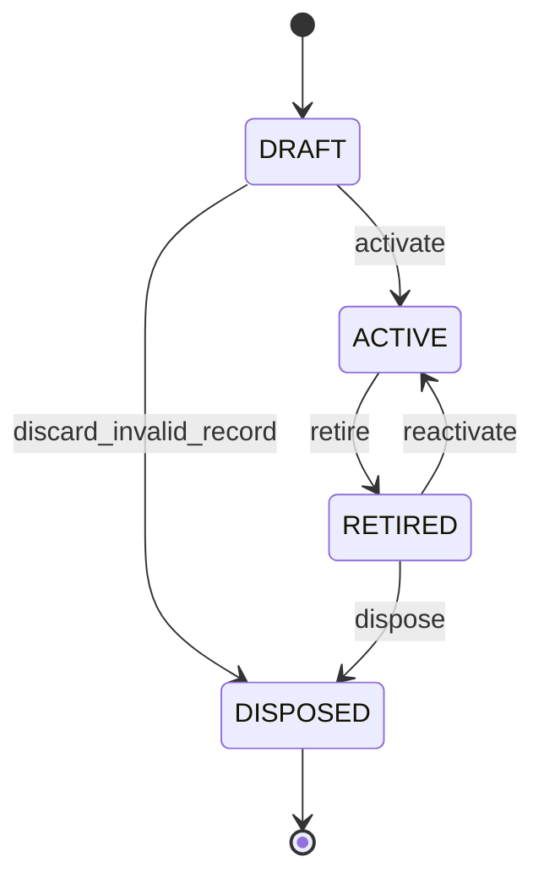
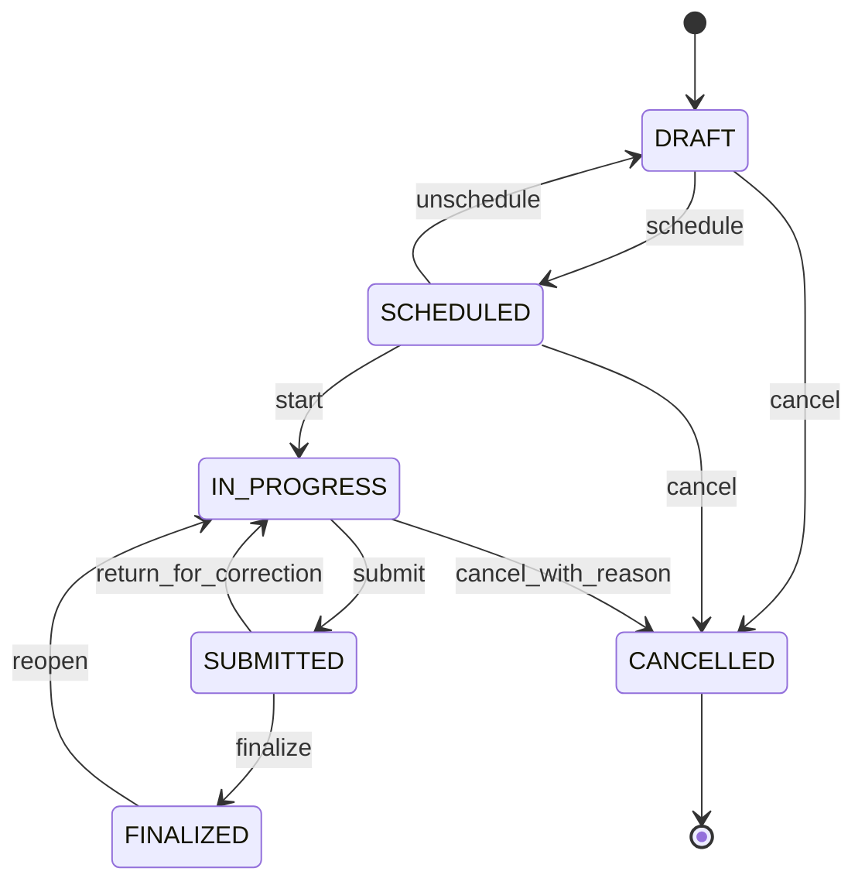
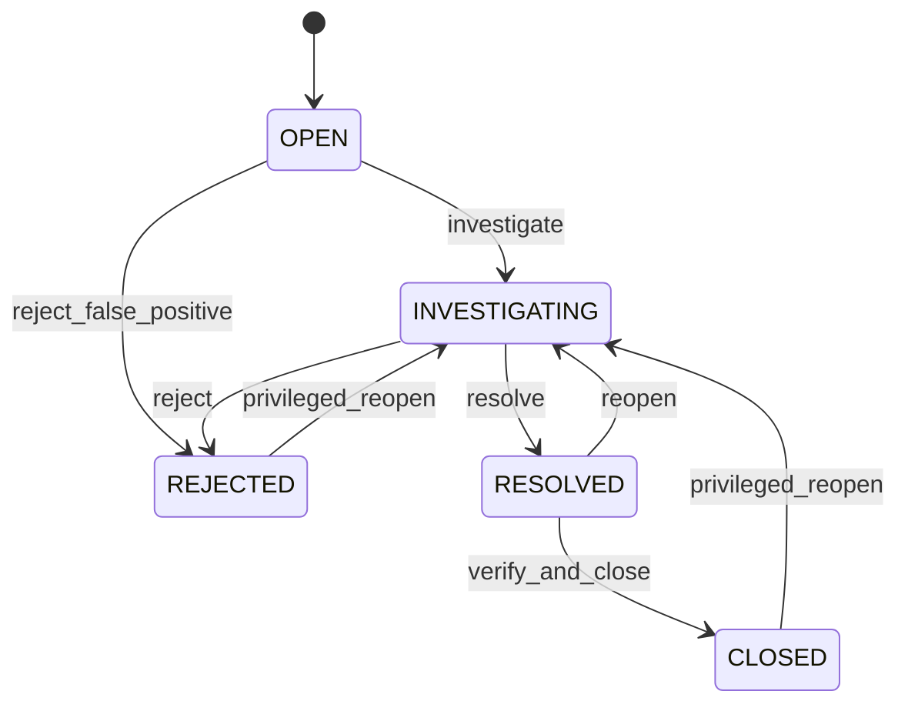

# Centralized Asset Management & Asset Audit System

## Enterprise MVP Architecture & Business Design Specification

**Document status:** Final Architecture Baseline v1.0  
**Target:** Production-oriented MVP developed by one developer  
**Primary database:** PostgreSQL  
**Architecture style:** Modular Monolith + Clean Architecture  
**Last updated:** 2026-08-28

---

## How to Use This Document

เอกสารนี้เป็น Single Source of Truth สำหรับการออกแบบ MVP ก่อนสร้าง PostgreSQL schema, migration, backend domain model, REST API, tests, frontend และ mobile scanner flow เมื่อมีการเปลี่ยน Business Rule ต้องแก้ Rule Catalog, Traceability, API, Constraint และ Acceptance Test ที่เกี่ยวข้องร่วมกัน

ลำดับความน่าเชื่อถือเมื่อข้อความขัดกัน:

1. Final Architecture Review และ Final Model
2. Business Rule Catalog
3. State Machine และ Source-of-Truth Matrix
4. Table/Constraint Specification
5. Use Case และ API Contract
6. ตัวอย่างประกอบ

---

# PART 1 — Domain Understanding

## 1.1 Business Domain

ระบบทำหน้าที่เป็นทะเบียนทรัพย์สินส่วนกลางและกลไกยืนยันทรัพย์สินทางกายภาพ โดยครอบคลุม 4 แกนธุรกิจ:

1. **Asset identity** — ทรัพย์สินคืออะไรและมี identifier ใดบ้าง
2. **Custody and location** — ปัจจุบันอยู่ที่ไหน ใครถือ และเคยเปลี่ยนอย่างไร
3. **Physical audit** — สิ่งที่คาดหวังกับสิ่งที่พบจริงตรงกันหรือไม่
4. **Accountability** — ใครทำอะไร เมื่อใด จากคำขอใด และข้อมูลก่อน/หลังเป็นอย่างไร

ระบบไม่ใช่ Inventory Quantity System สินค้าคงคลังแบบนับจำนวน แต่ติดตาม Asset แบบรายชิ้นที่มี identity และ history ของตนเอง

## 1.2 System Boundary

### In Boundary

- Authentication และ session lifecycle
- RBAC และ object-level authorization
- User, Role, Permission
- Category และ hierarchical Location
- Asset master และ lifecycle
- Barcode/QR identifier lifecycle
- Assignment history
- Movement history
- Audit campaign snapshot
- Mobile scan, idempotency และ duplicate handling
- Canonical audit observation/result
- Audit issue lifecycle
- Activity/security audit trail

### Outside MVP Boundary

- Procurement, PO และ receiving
- Accounting ledger และ depreciation
- Full maintenance/work-order system
- Vendor management
- RFID ingestion
- Notification delivery
- AI/advanced analytics
- Native offline application
- Multi-organization SaaS isolation

ระบบสามารถเก็บ acquisition date/cost เพื่อใช้ข้อมูลพื้นฐาน แต่ไม่ถือเป็น accounting source of truth

## 1.3 Actors

| Actor | Responsibility | Boundary |
|---|---|---|
| System Admin | Manage users, roles, permissions, sessions | ไม่จัดการผล audit โดยอัตโนมัติ |
| Asset Officer | Manage asset domain, assignment, transfer, campaign, issue | ต้องมี permission ราย action |
| Auditor | ตรวจ campaign ที่ได้รับมอบหมาย, scan, บันทึก observation/issue, submit | ห้ามแก้ asset master/location โดยตรง |
| Viewer/Management | Read asset และ audit reports | ไม่มี mutation permission |
| Mobile/Scanner Client | ส่ง scan event พร้อม idempotency/device metadata | ไม่ใช่ trusted actor; API ต้องตรวจทุกข้อมูล |
| Background Job | Mark pending assets as not found during finalize, cleanup sessions | ใช้ service identity และ activity log |

## 1.4 Core Entities and Aggregates

### Asset Aggregate

Aggregate root: `assets`

ประกอบด้วย:

- Asset master และ lifecycle/condition
- `asset_identifiers` สำหรับ Barcode/QR lifecycle
- `asset_assignments` สำหรับ custody timeline
- `asset_movements` สำหรับ location timeline

Assignment และ Movement เปลี่ยนผ่าน application service เฉพาะ ห้ามแก้ผ่าน generic Asset PATCH

### Audit Campaign Aggregate

Aggregate root: `audit_campaigns`

ประกอบด้วย:

- scope locations และ auditors
- `audit_campaign_assets` ซึ่งเป็น immutable snapshot ของ population
- `audit_scan_events` ซึ่งเป็น immutable ingestion events
- `audit_observations` ซึ่งเป็น canonical latest business observation ต่อ campaign asset
- `audit_issues` และ `audit_issue_transitions`

### Identity and Access Aggregate

- `users`, `roles`, `permissions`
- junction tables `user_roles`, `role_permissions`
- `auth_sessions`

### Auditability

- Domain history: assignment, movement, scan, issue transition
- Security/activity history: `activity_logs`
- Activity log ห้ามใช้แทน domain history

## 1.5 Core Architectural Decisions

| Decision | Reason | Alternative Considered | Trade-off |
|---|---|---|---|
| Modular Monolith | MVP พัฒนา/ทดสอบ/deploy คนเดียวได้ แต่แยก domain boundaries ชัด | Microservices | Scaling แยก service ทำภายหลัง |
| UUIDv7 เป็น internal ID | กระจาย generate ได้และ index locality ดีกว่า UUIDv4 | BIGSERIAL, UUIDv4 | อ่านยาก จึงต้องมี business code แยก |
| Asset code, DB ID, barcode token แยกกัน | แต่ละค่าเปลี่ยนและเปิดเผยต่างกัน | ใช้ asset_code ค่าเดียวทุกที่ | ต้อง join identifier เพิ่ม แต่ปลอดภัยและยืดหยุ่นกว่า |
| Campaign population เป็น snapshot | Final result reproducible แม้ master เปลี่ยนระหว่าง audit | Dynamic query | ใช้ storage เพิ่มและต้อง refresh ก่อน start |
| Scan event แยกจาก canonical observation | รองรับ retry, rescan, evidence และ forensic audit | เก็บ scan แถวเดียว | model ซับซ้อนขึ้นเล็กน้อย |
| Current location + immutable movement history | อ่านปัจจุบันเร็วและตอบ as-of ได้ | derive current จาก events เท่านั้น | ต้อง update atomically ใน transaction |
| Current assignee derive จาก active assignment | partial unique index ให้ invariant ชัด | เก็บ assets.assignee_id ซ้ำ | query ต้อง join แต่ตัด duplicate source of truth |
| Status แยกตาม dimension | Assignment, condition, missing ไม่ใช่ lifecycle เดียวกัน | enum status รวมทุกอย่าง | UI ต้องประกอบสถานะจากหลาย field |
| Text + CHECK สำหรับ state | เพิ่ม state ผ่าน migration ง่ายกว่า PostgreSQL ENUM | DB ENUM | CHECK ต้องดูแลให้ตรง domain constants |
| No generic soft delete | delete policy ตามความหมายของแต่ละ table | deleted_at ทุก table | implementation ไม่เป็นสูตรเดียวแต่ auditability ถูกต้อง |

---

# PART 2 — Assumptions

| ID | Assumption | Design Consequence |
|---|---|---|
| ASM-01 | MVP รองรับองค์กรเดียว หลาย branch/location | ยังไม่มี `organization_id` ทุก table; วาง extension point ที่ location root |
| ASM-02 | User คือ employee/internal operator เดียวกันใน MVP | Assignment อ้าง `users`; อนาคตแยก `people/employees` ได้ |
| ASM-03 | Asset เป็น serialized item หนึ่งชิ้น | ไม่มี quantity/on-hand model |
| ASM-04 | Asset code unique แบบ case-insensitive ภายในองค์กร | ใช้ normalized code + unique index on `lower(asset_code)` |
| ASM-05 | Serial number อาจซ้ำหรือว่างได้ | ไม่ใช้ global unique; ใช้ search index และ optional category/vendor validation |
| ASM-06 | Location มี tree เดียวและย้าย node ได้เฉพาะเมื่อไม่เกิด cycle | adjacency list `parent_id` + domain cycle check |
| ASM-07 | Audit ใช้ server authorization online ใน MVP | offline metadata ถูกเตรียมไว้ แต่ยังไม่ sync queue เต็มรูปแบบ |
| ASM-08 | เวลาธุรกิจเก็บเป็น `timestamptz` UTC และแสดงตาม timezone ผู้ใช้ | ป้องกัน ambiguity |
| ASM-09 | วัน acquisition ไม่ต้องมีเวลา | ใช้ `date` |
| ASM-10 | Cost เป็นข้อมูล informational ไม่ใช่ ledger | `numeric(19,4)` + ISO currency |
| ASM-11 | Barcode/QR token ไม่บรรจุ PII และไม่ใช้ DB ID ตรง | token random opaque อย่างน้อย 128 bits |
| ASM-12 | Auditor ต้องถูก assign campaign หรือมี override permission | object-level authorization ทุก scan |
| ASM-13 | Finalize อนุญาตเมื่อไม่มี pending items; open issues อนุญาตได้โดย policy แต่ต้อง acknowledge | ไม่บังคับ resolve issue ทุกอันก่อน finalize |
| ASM-14 | Reopen finalized campaign อนุญาตเฉพาะ Asset Officer พร้อมเหตุผล | เก็บ transition/activity log และห้ามลบผลเดิม |
| ASM-15 | Asset master เปลี่ยนระหว่าง campaign ได้ | snapshot เป็น expected truth ของ campaign; ไม่ rewrite ย้อนหลัง |
| ASM-16 | Wrong location จาก scan ไม่ย้าย asset อัตโนมัติ | ต้องผ่าน UC-05 Transfer/Correction |
| ASM-17 | Evidence file ยังไม่อยู่ใน MVP core | เก็บ `evidence_uri` nullable เพื่อเชื่อม attachment service ภายหลัง |
| ASM-18 | Permission assignments เปลี่ยนได้โดย admin | access token อายุสั้น; authorization อ่าน current grants หรือ versioned claims |
| ASM-19 | Activity log เป็น append-only operational audit ไม่ใช่ legal WORM | DB role จำกัด update/delete; export/WORM เป็น Phase 2 |
| ASM-20 | PostgreSQL 15+ | ใช้ partial indexes, generated/functional indexes และ robust constraints |

---

# PART 3 — Business Rule Catalog

## 3.1 Authentication and RBAC

| Rule ID | Rule | Enforcement |
|---|---|---|
| BR-AUTH-001 | Login อนุญาตเฉพาะ user `ACTIVE` และ password ถูกต้อง | API + Auth service |
| BR-AUTH-002 | Password ต้อง hash ด้วย Argon2id; ห้ามเก็บ/log plaintext | Auth service + Security review |
| BR-AUTH-003 | Refresh token เก็บเป็น hash, rotate ทุกครั้ง และ revoke reuse chain | Auth service + Transaction + UNIQUE |
| BR-AUTH-004 | Access token หมดอายุสั้นและ session ที่ revoked ใช้ refresh ไม่ได้ | Auth middleware + DB |
| BR-AUTH-005 | Login failure ต้อง rate-limit โดย account/IP โดยไม่เปิดเผยว่า email มีอยู่หรือไม่ | API gateway/Auth service |
| BR-RBAC-001 | ทุก mutation ต้องตรวจ permission ที่ backend | Authorization middleware + Application service |
| BR-RBAC-002 | Auditor scan ได้เฉพาะ campaign ที่ได้รับมอบหมาย เว้นแต่มี `audit:scan:any` | Object authorization query |
| BR-RBAC-003 | Viewer ไม่มี mutation permission | RBAC policy + tests |
| BR-RBAC-004 | User แก้ role/permission ของตนเองไม่ได้ เว้นแต่มี explicit admin permission | Application service |
| BR-RBAC-005 | การเปลี่ยน role/permission ต้องสร้าง activity log | Transactional audit write |

## 3.2 User, Category and Location

| Rule ID | Rule | Enforcement |
|---|---|---|
| BR-USR-001 | Email unique แบบ case-insensitive | DB unique index `lower(email)` |
| BR-USR-002 | User ที่ disabled login ใหม่ไม่ได้ แต่ history/assignment ต้องคงอยู่ | Domain + FK RESTRICT |
| BR-USR-003 | User disabled ที่ถือ asset ยังถืออยู่จนกว่าจะ return/reassign | Application warning; ไม่ cascade |
| BR-CAT-001 | Category code unique แบบ case-insensitive | DB unique index |
| BR-CAT-002 | Category ที่มี asset อ้างอิงห้าม hard delete | FK RESTRICT; ใช้ `is_active=false` |
| BR-CAT-003 | Category inactive ห้ามใช้กับ asset ใหม่ แต่ asset เดิมยังอ่านได้ | Domain/Application service |
| BR-LOC-001 | Location code unique แบบ case-insensitive | DB unique index |
| BR-LOC-002 | Location ห้ามเป็น parent ของตัวเองหรือ descendant ของตน | Domain traversal + transaction |
| BR-LOC-003 | Location inactive ห้ามเป็น destination ใหม่ | Domain/Application service |
| BR-LOC-004 | Location ที่มี asset/history ห้าม hard delete | FK RESTRICT; disable/archive |
| BR-LOC-005 | การ disable location ที่ยังมี active asset ต้อง reject หรือ require evacuation workflow | Domain query + transaction |

## 3.3 Asset and Identifier

| Rule ID | Rule | Enforcement |
|---|---|---|
| BR-AST-001 | Asset code ต้องไม่ว่างและ unique แบบ case-insensitive | NOT NULL + CHECK + unique index |
| BR-AST-002 | Asset ต้องมี active category และ current location ก่อน transition เป็น ACTIVE | State machine + Domain service |
| BR-AST-003 | Generic asset update ห้ามแก้ current location, assignee หรือ identifier | API contract + Application service |
| BR-AST-004 | DISPOSED asset ห้าม assign, transfer หรือสร้าง identifier ใหม่ | Domain guard + transaction |
| BR-AST-005 | RETIRED asset ห้าม assign; transfer ได้เฉพาะไป disposal/storage location ตาม policy | Domain guard |
| BR-AST-006 | Asset ที่มี domain history ห้าม hard delete | Repository policy + FK RESTRICT |
| BR-AST-007 | Lifecycle transition ต้องตรง state machine และมี expected `version` | Domain state machine + optimistic locking |
| BR-AST-008 | Cost ต้องไม่ติดลบ และ currency เป็น ISO 4217 uppercase 3 ตัวเมื่อมี cost | CHECK |
| BR-AST-009 | Serial number ไม่บังคับ unique เพราะผู้ผลิต/ประเภทอาจซ้ำ | Search index; optional future scoped rule |
| BR-IDN-001 | Identifier token unique ตลอดระบบ | UNIQUE |
| BR-IDN-002 | Asset มี active identifier ต่อ type ได้สูงสุดหนึ่งรายการ | Partial unique index |
| BR-IDN-003 | Regenerate คือ revoke identifier เดิมและสร้างใหม่ใน transaction | Domain + Transaction |
| BR-IDN-004 | Revoked identifier ห้ามใช้เป็น successful scan แต่ต้อง resolve เพื่อแจ้ง `IDENTIFIER_REVOKED` | Scan service |
| BR-IDN-005 | Identifier ที่เคยใช้ห้าม hard delete/reuse | Immutable lifecycle + UNIQUE |
| BR-IDN-006 | QR/Barcode encode opaque token ไม่ใช่ PII, asset code หรือ raw UUID | Identifier service |

## 3.4 Assignment and Movement

| Rule ID | Rule | Enforcement |
|---|---|---|
| BR-ASG-001 | Asset มี active assignment (`ended_at IS NULL`) ได้สูงสุดหนึ่งรายการ | Domain + Partial unique index |
| BR-ASG-002 | Assign ได้เฉพาะ ACTIVE asset และ active user | Domain + transaction |
| BR-ASG-003 | เปลี่ยนผู้ถือครองต้อง end เดิมและ create ใหม่ atomically | Row lock + Transaction |
| BR-ASG-004 | `ended_at` ต้องมากกว่าหรือเท่ากับ `started_at` | CHECK |
| BR-ASG-005 | Assignment history ห้าม update ยกเว้น close active row ผ่าน service | Repository restriction + audit |
| BR-ASG-006 | Backdate ที่ทำให้ช่วงเวลาซ้อนกันต้อง reject | Domain overlap query + exclusion/lock strategy |
| BR-ASG-007 | Asset condition IN_REPAIR ห้าม assign/reassign จน conditionเปลี่ยนผ่าน authorized update | Domain guard |
| BR-MOV-001 | การเปลี่ยน current location ทุกครั้งต้องสร้าง movement | Transaction + restricted repository |
| BR-MOV-002 | `from_location_id` ต้องตรง current location ที่ lock ไว้ | Domain + SELECT FOR UPDATE |
| BR-MOV-003 | Source และ destination ต้องต่างกัน | CHECK |
| BR-MOV-004 | Destination ต้อง active และอนุญาตรับ asset | Domain/Application service |
| BR-MOV-005 | Movement event ที่ commit แล้ว immutable | DB privilege + no update endpoint |
| BR-MOV-006 | Transfer ของ DISPOSED asset reject | Domain guard |

## 3.5 Audit Campaign and Scan

| Rule ID | Rule | Enforcement |
|---|---|---|
| BR-AUD-001 | Campaign name ไม่ว่าง; end date ต้องไม่ก่อน start date | CHECK + validation |
| BR-AUD-002 | Campaign ต้องมีอย่างน้อยหนึ่ง asset ก่อน SCHEDULED/IN_PROGRESS | Domain query |
| BR-AUD-003 | Population snapshot แก้ได้เฉพาะ DRAFT; หลัง start immutable | State machine + repository guard |
| BR-AUD-004 | Asset หนึ่งรายการอยู่ใน campaign ได้หนึ่ง snapshot row | UNIQUE(campaign_id, asset_id) |
| BR-AUD-005 | Start ได้จาก SCHEDULED/DRAFT ที่ valid เท่านั้น | State machine + transaction |
| BR-AUD-006 | Submit ได้เมื่อ actor เป็น assigned auditor และ campaign IN_PROGRESS | Object auth + state machine |
| BR-AUD-007 | Finalize ต้องไม่มี PENDING snapshot; policy open issue ต้องถูก acknowledge | Domain query + transaction |
| BR-AUD-008 | Finalized/cancelled campaignห้าม accepted scan/canonical mutation; authenticated valid requestเก็บ rejected eventได้ | Domain guard under campaign row lock |
| BR-AUD-009 | Reopen FINALIZED ต้องมี permission และ reason; ผลเดิมไม่ถูกลบ | State machine + audit log |
| BR-AUD-010 | Master data change ไม่ rewrite expected snapshot | Immutable snapshot policy |
| BR-AUD-011 | Finalizeเป็น explicit confirmationที่แปลง PENDING เป็น NOT_FOUND atomically; ห้ามมี PENDINGหลัง commit | Domain + Transaction + CHECK/query test |
| BR-SCN-001 | ทุก scan request ต้องมี globally unique `client_event_id` ต่อ client namespace | UNIQUE(device_id, client_event_id) |
| BR-SCN-002 | Retry ด้วย idempotency key เดิมคืนผลเดิม ไม่สร้าง event ใหม่ | Idempotency lookup + Transaction |
| BR-SCN-003 | Scan intent ใหม่ของ asset เดิมสร้าง immutable event ใหม่ แต่ canonical count ยังเป็นหนึ่ง | Event insert + observation upsert |
| BR-SCN-004 | Unknown identifier สร้าง rejected scan event และ optional UNKNOWN_ASSET issue | Scan service |
| BR-SCN-005 | Asset นอก campaign สร้าง rejected event; ไม่เพิ่ม progress | Scan service |
| BR-SCN-006 | Wrong location/assignee เป็น observation+issue; ห้ามแก้ master อัตโนมัติ | Domain service |
| BR-SCN-007 | `scanned_at` เป็น client event time; `received_at` เป็น server time และต้องเก็บทั้งคู่ | NOT NULL + server default |
| BR-SCN-008 | Client time ต่างจาก server เกิน policy ต้อง flag แต่ไม่ทิ้ง event โดยอัตโนมัติ | Domain validation |
| BR-SCN-009 | Canonical observation ต่อ campaign asset มีได้สูงสุดหนึ่ง row | UNIQUE(campaign_asset_id) |
| BR-SCN-010 | Re-scan ที่เปลี่ยน canonical observation ต้องระบุ reason หรือเป็น policy-authorized latest observation | Domain + activity log |

## 3.6 Issue, Activity and Security

| Rule ID | Rule | Enforcement |
|---|---|---|
| BR-ISS-001 | Issue transition ต้องตรง state machine | Domain state machine |
| BR-ISS-002 | RESOLVE ต้องมี resolution note และ resolver | CHECK + Domain |
| BR-ISS-003 | CLOSED/REJECTED แก้รายละเอียดโดยตรงไม่ได้ | Domain guard |
| BR-ISS-004 | Reopen ต้องสร้าง transition ใหม่พร้อม reason | Domain + immutable history |
| BR-ISS-005 | Issue อาจผูก campaign asset หรือ rejected unknown scan แต่ต้องมีอย่างน้อยหนึ่ง context | CHECK |
| BR-LOG-001 | Critical mutation ต้องมี activity log ใน transaction เดียวกันเมื่อทำได้ | Application service + Transaction |
| BR-LOG-002 | Activity log append-only และห้าม generic update/delete | DB role/Repository |
| BR-LOG-003 | Before/after ต้อง redact password, token, secret และ sensitive payload | Audit serializer allowlist |
| BR-LOG-004 | Domain history ห้าม derive จาก activity log เพียงอย่างเดียว | Architecture rule |
| BR-SEC-001 | Object-level authorization ต้องตรวจ campaign/asset scope หลัง RBAC | Application service |
| BR-SEC-002 | File/scan input ต้อง validate length, format และ content type | API validation |
| BR-SEC-003 | ทุก SQL ใช้ parameterization; ห้ามประกอบ SQL จาก input โดยตรง | Repository standard |
| BR-SEC-004 | Request ID ต้อง propagate และบันทึกใน critical logs | Middleware |

## 3.7 Business Rule Traceability

| Rule Group | Use Cases | Primary Entities | API Area | Constraint/Test Impact |
|---|---|---|---|---|
| BR-AUTH-* | UC-01 | users, auth_sessions, auth_refresh_tokens | `/auth/*` | token hash/rotation/reuse/rate-limit tests |
| BR-RBAC-* | ทุก UC mutation | roles, permissions, junctions | ทุก protected endpoint | permission matrix tests |
| BR-USR-* | UC-01, UC-04 | users | `/users` | email unique, disable/assignment tests |
| BR-CAT-* | UC-02 | asset_categories, assets | `/asset-categories` | RESTRICT/inactive tests |
| BR-LOC-* | UC-02, UC-05, UC-06 | locations, assets, movements | `/locations`, `/transfers` | cycle/active/FK tests |
| BR-AST-* | UC-02, UC-04, UC-05 | assets | `/assets` | lifecycle/check/version tests |
| BR-IDN-* | UC-03, UC-07 | asset_identifiers | `/identifiers`, `/scans` | token/partial unique/revoke tests |
| BR-ASG-* | UC-04 | asset_assignments | `/assets/:id/assignments` | partial unique/concurrency tests |
| BR-MOV-* | UC-05, UC-08 | asset_movements, assets | `/assets/:id/transfers` | row-lock/atomicity/history tests |
| BR-AUD-* | UC-06, UC-10, UC-11 | audit_campaigns, campaign_assets | `/audit-campaigns` | snapshot/state/finalize tests |
| BR-SCN-* | UC-07, UC-08, UC-09 | scan_events, observations | `/audit-campaigns/:id/scans` | idempotency/duplicate/time tests |
| BR-ISS-* | UC-09, UC-10 | audit_issues, issue_transitions | `/audit-issues` | state/resolution/reopen tests |
| BR-LOG-* | UC-12 | activity_logs | cross-cutting | immutability/redaction tests |
| BR-SEC-* | ทุก UC | cross-cutting | all | authorization/input/log tests |

รายละเอียด traceability ระดับราย Rule ถูกอ้างใน Use Case, endpoint และ Acceptance Criteria ด้วย Rule ID เดียวกัน

## 3.8 Rule-level Traceability Matrix

| Rule ID | Rule (Short) | Use Case | Entity / API | Enforcement / Required Test |
|---|---|---|---|---|
| BR-AUTH-001 | Active user + valid password | UC-01 | users, `/auth/login` | Auth service; inactive/invalid login tests |
| BR-AUTH-002 | Argon2id, no plaintext | UC-01/12 | users/activity_logs | Hash/redaction security tests |
| BR-AUTH-003 | Rotate hash + revoke reuse family | UC-01 | auth_sessions, auth_refresh_tokens | Row lock/UNIQUE; replay test |
| BR-AUTH-004 | Expiry/revocation enforced | UC-01 | auth_sessions, auth middleware | expired/revoked session tests |
| BR-AUTH-005 | Login rate limit/no enumeration | UC-01 | `/auth/login` | Gateway/Auth; enumeration/rate test |
| BR-RBAC-001 | Backend permission on mutation | UC-01..12 | all mutation APIs | middleware + integration matrix |
| BR-RBAC-002 | Auditor campaign scope | UC-07/08/11 | campaign_auditors, scan/result APIs | object auth tests |
| BR-RBAC-003 | Viewer read-only | UC-11/12 | protected APIs | deny-all mutation tests |
| BR-RBAC-004 | No unauthorized self-escalation | IAM support | user_roles | service rule; privilege test |
| BR-RBAC-005 | Grant changes logged | UC-12 | user_roles/role_permissions | transaction + activity assertion |
| BR-USR-001 | Email unique CI | UC-01/IAM | users | unique index; case-duplicate test |
| BR-USR-002 | Disabled user cannot login | UC-01 | users/auth | service; disable-session tests |
| BR-USR-003 | Disable does not erase assignment | UC-04 | users/assignments | FK RESTRICT; history test |
| BR-CAT-001 | Category code unique CI | UC-02 | asset_categories | unique index test |
| BR-CAT-002 | Referenced category no hard delete | UC-02 | categories/assets | FK RESTRICT test |
| BR-CAT-003 | Inactive category not for new asset | UC-02 | categories/assets API | service + integration test |
| BR-LOC-001 | Location code unique CI | UC-02/05 | locations | unique index test |
| BR-LOC-002 | Location tree no cycle | Catalog support | locations | domain traversal + race test |
| BR-LOC-003 | Inactive location no new destination | UC-02/05 | locations/assets/movements | service test |
| BR-LOC-004 | Referenced location no hard delete | UC-05/06 | location history/snapshot | FK RESTRICT test |
| BR-LOC-005 | Disable requires evacuation | UC-05 | locations/assets | transactional count/deny test |
| BR-AST-001 | Asset code unique CI | UC-02 | assets, `POST /assets` | unique index; case test |
| BR-AST-002 | Active asset needs valid category/location | UC-02 | assets/catalog | state guard test |
| BR-AST-003 | Generic PATCH cannot change relationship state | UC-02/05 | `PATCH /assets` | request allowlist test |
| BR-AST-004 | Disposed asset no assignment/transfer/tag | UC-03/04/05 | assets/commands | state guard tests |
| BR-AST-005 | Retired assignment restricted | UC-04/05 | assets/assignments | domain tests |
| BR-AST-006 | Asset history prevents hard delete | UC-02 | assets/history FKs | repository/FK test |
| BR-AST-007 | Valid transition + version | UC-02/05 | assets/lifecycle API | state/version conflict tests |
| BR-AST-008 | Nonnegative cost/currency pair | UC-02 | assets | CHECK + validation test |
| BR-AST-009 | Serial may repeat | UC-02 | assets | duplicate serial accepted test |
| BR-IDN-001 | Token globally unique | UC-03/07 | asset_identifiers | UNIQUE + collision retry test |
| BR-IDN-002 | One active identifier/type | UC-03 | asset_identifiers | partial unique/race test |
| BR-IDN-003 | Replace atomically | UC-03 | identifier replace API | lock+transaction rollback test |
| BR-IDN-004 | Revoked tag not successful | UC-07 | scan API/identifiers | revoked scan test |
| BR-IDN-005 | No identifier delete/reuse | UC-03/12 | identifiers/history | repository/unique test |
| BR-IDN-006 | Opaque tag, no PII/UUID | UC-03 | identifier generator | format/entropy/security test |
| BR-ASG-001 | One active assignment | UC-04 | asset_assignments | partial unique/concurrency test |
| BR-ASG-002 | Active asset/user only | UC-04 | assets/users/assignments | domain integration tests |
| BR-ASG-003 | Reassign closes+creates atomically | UC-04 | assignments API | rollback/concurrency test |
| BR-ASG-004 | End >= start | UC-04 | asset_assignments | CHECK test |
| BR-ASG-005 | History only controlled close | UC-04/12 | assignment repository | no-update endpoint test |
| BR-ASG-006 | No temporal overlap | UC-04 | asset_assignments | GiST exclusion/backdate test |
| BR-ASG-007 | IN_REPAIR cannot assign | UC-04 | assets/assignments | condition guard test |
| BR-MOV-001 | Location change always movement | UC-05 | assets/movements | transaction/history assertion |
| BR-MOV-002 | From must equal locked current | UC-05 | movement API | stale source/race test |
| BR-MOV-003 | From != to | UC-05 | asset_movements | CHECK test |
| BR-MOV-004 | Destination active | UC-05 | locations/movements | domain test |
| BR-MOV-005 | Movement immutable | UC-05/12 | movement repository | deny update/delete test |
| BR-MOV-006 | Disposed cannot transfer | UC-05 | assets/movements | state test |
| BR-AUD-001 | Campaign name/date valid | UC-06 | audit_campaigns | CHECK/validation tests |
| BR-AUD-002 | Nonempty before schedule/start | UC-06 | campaigns/snapshot | CAMPAIGN_EMPTY test |
| BR-AUD-003 | Snapshot editable only DRAFT | UC-06/11 | campaign_assets | state/repository test |
| BR-AUD-004 | Asset once per campaign | UC-06 | campaign_assets | composite UNIQUE test |
| BR-AUD-005 | Start transition valid | UC-06 | campaign state API | state-machine tests |
| BR-AUD-006 | Assigned auditor submits | UC-10 | campaign_auditors | object auth/state test |
| BR-AUD-007 | Finalize pending/issues policy | UC-10 | observations/issues | finalization integration test |
| BR-AUD-008 | Final/cancelled rejects scan | UC-07/10 | campaigns/scans | scan-finalize race test |
| BR-AUD-009 | Reopen permission/reason/history | UC-10 | campaign transitions | permission/history test |
| BR-AUD-010 | Master change never rewrites snapshot | UC-06/08/11 | campaign_assets | snapshot immutability test |
| BR-AUD-011 | Finalize leaves no pending | UC-10 | observations/campaign | atomic conversion/count test |
| BR-SCN-001 | Unique device+client event | UC-07 | scan_events | composite UNIQUE test |
| BR-SCN-002 | Retry returns same result | UC-07 | scan API | identical retry test |
| BR-SCN-003 | Intentional duplicate event, one count | UC-07/11 | events/observations | count test |
| BR-SCN-004 | Unknown tag event/issue | UC-07/09 | scans/issues | unknown token test |
| BR-SCN-005 | Outside campaign no progress | UC-07 | snapshot/scans | outside-campaign test |
| BR-SCN-006 | Mismatch no master mutation | UC-08 | observation/issue/asset | immutability test |
| BR-SCN-007 | Store event/server times | UC-07 | scan_events | timestamp persistence test |
| BR-SCN-008 | Clock skew flagged/policy | UC-07 | scan service | skew boundary tests |
| BR-SCN-009 | One canonical observation | UC-07/11 | audit_observations | UNIQUE/race test |
| BR-SCN-010 | Revision requires authorized reason | UC-07 | scans/observations/log | rescan authorization test |
| BR-ISS-001 | Issue state machine only | UC-09 | issues/transitions API | transition matrix tests |
| BR-ISS-002 | Resolution fields required | UC-09 | audit_issues | CHECK/domain test |
| BR-ISS-003 | Closed/rejected no direct edit | UC-09 | issue API | immutability test |
| BR-ISS-004 | Reopen creates reasoned history | UC-09 | issue_transitions | reopen test |
| BR-ISS-005 | Issue has valid context | UC-08/09 | issues/scans/snapshot | CHECK/composite FK test |
| BR-LOG-001 | Critical mutation + log atomic | UC-12/all writes | activity_logs | forced-log-failure rollback test |
| BR-LOG-002 | Activity append-only | UC-12 | activity_logs | DB role/repository test |
| BR-LOG-003 | Secrets redacted | UC-01/12 | audit serializer | secret fixture test |
| BR-LOG-004 | Activity not domain history | UC-04/05/07/09 | domain history tables | architecture/integration assertions |
| BR-SEC-001 | Object authorization | UC-07/11 | campaign/assets APIs | cross-object denial tests |
| BR-SEC-002 | Input limits/formats | all write UCs | API schemas | fuzz/boundary tests |
| BR-SEC-003 | Parameterized SQL | all | repositories | code review/static/security test |
| BR-SEC-004 | Request ID propagated | UC-12/all | middleware/logs | correlation integration test |

---

# PART 4 — Detailed Use Cases

## UC-01 — Login

| Field | Detail |
|---|---|
| Goal | ยืนยันตัวตนและออก access/refresh session ตามสิทธิ์ปัจจุบัน |
| Primary Actor | User |
| Secondary Actor | Auth Service, Rate Limiter |
| Preconditions | User มีอยู่และ ACTIVE |
| Trigger | ส่ง email/password |
| Permissions | Public endpoint; session management ต้องเป็นเจ้าของ session หรือ admin |

**Main flow**

1. Normalize email และตรวจ rate limit
2. ค้น user โดยไม่เปิดเผยผลต่อ attacker
3. Verify Argon2id hash
4. โหลด roles/permissions ปัจจุบัน
5. สร้าง `auth_sessions` และ `auth_refresh_tokens` โดยเก็บเฉพาะ token hash
6. ออก short-lived access token และ refresh token
7. บันทึก `LOGIN_SUCCEEDED`

**Alternative/exception flow**

- credential ผิด → generic `AUTH_INVALID_CREDENTIALS`
- user disabled → generic response เดียวกับ credential ผิด แต่ internal reason ต่างกัน
- rate limited → `AUTH_RATE_LIMITED`
- refresh token reuse → revoke token family และบันทึก security event

**Postconditions:** มี active session หนึ่งรายการ; ไม่มี plaintext token ใน DB/log  
**Rules:** BR-AUTH-001..005, BR-LOG-003  
**Database changes:** insert/update `auth_sessions`, insert `activity_logs`  
**Audit events:** LOGIN_SUCCEEDED, LOGIN_FAILED, TOKEN_REFRESHED, SESSION_REVOKED

## UC-02 — Register Asset

| Field | Detail |
|---|---|
| Goal | สร้าง asset master ที่มี identity, category และ location เริ่มต้น |
| Primary Actor | Asset Officer |
| Preconditions | category/location active; actor มี `asset:create` |
| Trigger | ส่งข้อมูล asset |
| Permissions | `asset:create` |

**Main flow**

1. Validate/normalize asset code, currency และ metadata
2. ตรวจ category/location active
3. สร้าง asset เป็น DRAFT หรือ ACTIVE ตามความครบถ้วน
4. สร้าง initial movement จาก `NULL → initial_location`
5. Optionally generate initial barcode/QR ผ่าน UC-03
6. บันทึก activity before=null/after=safe asset snapshot

**Alternative/exception flow:** code ซ้ำ, category/location inactive, invalid lifecycle/cost, optimistic conflict  
**Postconditions:** asset และ initial movement สอดคล้องกัน  
**Rules:** BR-AST-001..009, BR-CAT-003, BR-LOC-003, BR-MOV-001  
**Database changes:** assets, asset_movements, optional asset_identifiers, activity_logs  
**Audit events:** ASSET_CREATED, ASSET_IDENTIFIER_CREATED

## UC-03 — Generate or Replace Barcode/QR

| Field | Detail |
|---|---|
| Goal | ออก opaque identifier ที่ unique และติดตาม lifecycle ได้ |
| Primary Actor | Asset Officer |
| Preconditions | Asset ไม่ DISPOSED; actor มี `asset:identifier:manage` |
| Trigger | ขอ generate/replace identifier type |
| Permissions | `asset:identifier:manage` |

**Main flow**

1. Lock asset และ active identifier ของ type นั้น
2. สร้าง cryptographically random token
3. ถ้า replace ให้ mark เดิม REPLACED/REVOKED และ set `valid_to`
4. Insert active identifier ใหม่
5. Render Code128/QR จาก token หรือ URL ที่มี token
6. Commit และสร้าง activity log

**Decision:** ไม่ encode DB UUID/asset code เพื่อไม่เปิดเผย sequential/business data และให้ revoke/replace ได้  
**Duplicate:** token collision retry ได้; DB UNIQUE เป็น final guard  
**Old barcode:** resolve ได้เพื่อแสดง `IDENTIFIER_REVOKED` แต่ไม่ถือเป็น valid scan  
**Rules:** BR-IDN-001..006  
**Database changes:** update old + insert new `asset_identifiers`, activity_logs  
**Audit events:** IDENTIFIER_CREATED, IDENTIFIER_REPLACED, IDENTIFIER_REVOKED

## UC-04 — Assign/Reassign/Return Asset

| Field | Detail |
|---|---|
| Goal | บันทึกผู้ถือครองปัจจุบันและ history โดยไม่เกิด active assignment ซ้ำ |
| Primary Actor | Asset Officer |
| Secondary Actor | Assignee |
| Preconditions | Asset ACTIVE, user ACTIVE, actor มี permission |
| Trigger | Assign, reassign หรือ return |
| Permissions | `asset:assign` |

**Main flow (assign):** lock asset; verify no active assignment; insert row `started_at`, `ended_at=NULL`; log  
**Reassign:** lock asset; close active row; insert new rowใน transaction เดียว  
**Return:** lock asset; close active row; ไม่สร้าง row ใหม่  
**Exceptions:** asset disposed/retired, user inactive, active assignment conflict, stale version/backdate overlap  
**Postconditions:** active assignment 0 หรือ 1; history preserved  
**Rules:** BR-ASG-001..006, BR-AST-004..005  
**Database changes:** asset_assignments, activity_logs  
**Audit events:** ASSET_ASSIGNED, ASSET_REASSIGNED, ASSET_RETURNED

## UC-05 — Transfer Asset

| Field | Detail |
|---|---|
| Goal | ย้าย current location พร้อม immutable movement history |
| Primary Actor | Asset Officer |
| Preconditions | Destination active; source ตรงกับ current; lifecycle อนุญาต |
| Trigger | ส่ง destination, reason, effective time, expected version |
| Permissions | `asset:transfer` |

**Main flow**

1. `SELECT ... FOR UPDATE` asset
2. Validate expected version/source/lifecycle/destination
3. Insert `asset_movements(from,to,effective_at,actor,reason)`
4. Update `assets.current_location_id` และ increment version
5. Insert activity log และ commit

**Alternative:** correction movement ใช้ `movement_type=CORRECTION` และ mandatory reason; ไม่แก้ event เดิม  
**Exceptions:** same location, inactive destination, stale version, disposed asset  
**Rules:** BR-MOV-001..006, BR-AST-007  
**Database changes:** asset_movements + assets + activity_logs atomically  
**Audit events:** ASSET_TRANSFERRED, ASSET_LOCATION_CORRECTED

## UC-06 — Create Audit Campaign

| Field | Detail |
|---|---|
| Goal | สร้างรอบตรวจและ freeze expected population ก่อนเริ่ม |
| Primary Actor | Asset Officer |
| Preconditions | Actor มี `audit:create`; scope valid |
| Trigger | ส่งชื่อ ช่วงเวลา locations/filter และ auditors |
| Permissions | `audit:create`, `audit:scope:manage` |

**Main flow**

1. Create DRAFT campaign
2. บันทึก locations และ auditors
3. Query assets ตาม scope
4. Insert `audit_campaign_assets` พร้อม snapshot code/name/location/assignee/status/identifier
5. แสดง preview/count ให้ officer ตรวจ
6. Officer schedule/start; หลัง start snapshot immutable

**Snapshot decision:** เลือก snapshot เพราะผลตรวจต้อง reproducible และไม่เปลี่ยนตาม master data ระหว่าง campaign; dynamic query ใช้ได้เฉพาะ preview/refresh ตอน DRAFT  
**Exceptions:** scope ว่าง, campaign ไม่มี asset, date invalid, duplicate asset  
**Rules:** BR-AUD-001..005  
**Database changes:** campaigns, campaign_locations, campaign_auditors, campaign_assets, activity_logs  
**Audit events:** CAMPAIGN_CREATED, CAMPAIGN_SCOPE_REFRESHED, CAMPAIGN_STARTED

## UC-07 — Scan Asset

| Field | Detail |
|---|---|
| Goal | รับ scan อย่าง idempotent, เก็บ event ทุก intent และ update canonical observation ครั้งเดียว |
| Primary Actor | Auditor |
| Secondary Actor | Mobile/Scanner Client |
| Preconditions | Campaign IN_PROGRESS; auditor assigned; identifier supplied |
| Trigger | Scan request พร้อม client_event_id/device_id/scanned_at |
| Permissions | `audit:scan` + campaign assignment |

**Main flow**

1. Validate payload, campaign permission และ idempotency key
2. Lock campaign row; หาก stateไม่รับ scanให้บันทึก idempotent event `REJECTED_STATE` แล้วคืน conflictโดยไม่แก้ canonical result
3. Resolve active identifier → asset
4. Resolve campaign asset snapshot
5. Insert immutable scan event
6. Compare observed location/assignee/condition กับ snapshot
7. Create/update canonical observation ตาม rescan policy
8. Create issues สำหรับ mismatch/damage ตาม policy
9. Return canonical result และ duplicate metadata

**Duplicate policy**

- Network retry: `device_id + client_event_id` เดิม → คืน response เดิม; ไม่ insert ใหม่
- Intentional second scan: client_event_id ใหม่ → insert event `DUPLICATE`/`RESCAN`; ไม่เพิ่ม unique scanned count
- Authorized rescan: update canonical observation พร้อม reason; event เดิมคงอยู่

**Exceptions:** identifier unknown/revoked, asset outside campaign, campaign finalized, clock skew, permission denied  
**Rules:** BR-AUD-008, BR-SCN-001..010  
**Database changes:** audit_scan_events, audit_observations, optional issues, activity_logs  
**Audit events:** ASSET_SCANNED, SCAN_REJECTED, OBSERVATION_REVISED

## UC-08 — Report Wrong Location

| Field | Detail |
|---|---|
| Goal | เก็บ expected/observed location และเปิด issue โดยไม่แก้ master |
| Primary Actor | Auditor |
| Preconditions | Valid campaign observation; location known |
| Trigger | Scan comparison หรือ manual report |
| Permissions | `issue:create` + campaign assignment |

**Main flow:** บันทึก observed location/time/note/evidence; create WRONG_LOCATION issue ที่อ้าง campaign asset/scan; แสดง expected snapshot; notify result layer  
**Exception:** observed location inactiveยังบันทึกได้เพราะเป็น historical fact แต่ flag warning  
**Postcondition:** master `assets.current_location_id` ไม่เปลี่ยน; correction ต้องใช้ UC-05  
**Rules:** BR-SCN-006, BR-ISS-005  
**Audit events:** WRONG_LOCATION_REPORTED, ISSUE_CREATED

## UC-09 — Report and Resolve Audit Issue

| Field | Detail |
|---|---|
| Goal | จัดการ missing/wrong assignee/damaged/barcode/unknown/other ผ่าน lifecycle |
| Primary Actor | Auditor (create), Asset Officer (investigate/resolve/close) |
| Preconditions | มี campaign context หรือ rejected scan context |
| Trigger | anomaly พบจาก scan/finalize/manual review |
| Permissions | `issue:create`, `issue:investigate`, `issue:resolve`, `issue:close` |

**Main flow:** create OPEN → assign/investigate → add resolution → RESOLVED → verify/close  
**Alternatives:** reject false positive; reopenด้วย reason; issue หลายประเภทต่อ asset ได้แต่ duplicate open issue type/campaign ป้องกันตาม policy  
**Exceptions:** invalid transition, missing resolution note, closed issue direct edit  
**Rules:** BR-ISS-001..005  
**Database changes:** audit_issues, audit_issue_transitions, activity_logs  
**Audit events:** ISSUE_CREATED, ISSUE_STATE_CHANGED, ISSUE_RESOLVED, ISSUE_REOPENED

## UC-10 — Submit and Finalize Audit

| Field | Detail |
|---|---|
| Goal | ปิดรอบตรวจอย่าง deterministic และสร้าง NOT_FOUND สำหรับ pending |
| Primary Actor | Auditor submit; Asset Officer finalize |
| Preconditions | Campaign IN_PROGRESS/SUBMITTED ตาม action |
| Trigger | Submit/finalize request พร้อม expected version |
| Permissions | `audit:submit`, `audit:finalize` |

**Main flow**

1. Lock campaign และตรวจ version/state
2. Submit: เปลี่ยน IN_PROGRESS → SUBMITTED
3. Finalize: สร้าง canonical NOT_FOUND observations สำหรับ remaining pending
4. สร้าง MISSING issues ตาม policy
5. ตรวจ open issues; require acknowledgement/reason หากยังเปิด
6. Persist summary counts snapshot, set FINALIZED/finalized_at/by
7. Log before/after และ commit

**Reopen:** FINALIZED → IN_PROGRESS เฉพาะ `audit:reopen`, mandatory reason, increment version; ไม่ลบ observations/events/issues  
**Concurrency:** campaign row lock ทำให้ scan ที่กำลัง commit จบก่อน หรือ scan หลัง lock ถูก rejectตาม state  
**Rules:** BR-AUD-006..011  
**Database changes:** campaign, observations, issues, activity_logs  
**Audit events:** CAMPAIGN_SUBMITTED, CAMPAIGN_FINALIZED, CAMPAIGN_REOPENED

## UC-11 — View Audit Result

| Field | Detail |
|---|---|
| Goal | แสดง progress/result จาก canonical data โดยไม่ double count scan events |
| Primary Actor | Asset Officer, Auditor assigned, Viewer |
| Preconditions | มี campaign และ object authorization ผ่าน |
| Trigger | เปิด result endpoint/page |
| Permissions | `audit:read`; auditor scoped to assigned campaign |

**Metrics:** total snapshot rows, observed, not found, pending, location mismatch, assignee mismatch, damaged, open issues, rejected/duplicate scan events  
**Source:** campaign_assets + observations + issues; ห้ามนับ raw scan events เป็น scanned assets  
**Rules:** BR-AUD-003, BR-SCN-003/009  
**Database changes:** none  
**Audit events:** optional sensitive report access log

## UC-12 — Activity Log

| Field | Detail |
|---|---|
| Goal | ตอบ WHO/WHAT/ENTITY/WHEN/FROM/BEFORE/AFTER |
| Primary Actor | System; Admin/authorized reviewer for read |
| Preconditions | Mutation สำคัญหรือ security event |
| Trigger | Application service operation |
| Permissions | `activity-log:read` สำหรับ query |

**Main flow:** application service สร้าง allowlisted before/after snapshot; middleware เติม actor/request/IP/user-agent; insert append-only logใน transactionเดียวกับ mutationเมื่อทำได้  
**Exceptions:** log serialization failure สำหรับ critical mutationต้อง rollback; async low-risk access telemetryไม่ควร block core flow  
**Rules:** BR-LOG-001..004, BR-SEC-004  
**Database changes:** activity_logs  
**Prohibited fields:** password, password hash, access/refresh token, authorization header, secret, full file bytes

---

# PART 5 — State Machines

## 5.1 Asset Lifecycle

Assignment, location, condition และ audit finding เป็นคนละ dimension จึงไม่ใช้ `ASSIGNED`, `LOST`, `IN_REPAIR` เป็น lifecycle state



Condition dimension: `UNKNOWN | GOOD | DAMAGED | IN_REPAIR` ไม่ควบคุม lifecycle transition โดยตรง แต่ business guard อาจห้าม assignment เมื่อ IN_REPAIR

| Current | Action | Next | Allowed Role | Rules |
|---|---|---|---|---|
| DRAFT | activate | ACTIVE | Asset Officer | category/location active; BR-AST-002 |
| DRAFT | discard invalid record | DISPOSED | Asset Officer | no assignment; reason required |
| ACTIVE | retire | RETIRED | Asset Officer | active assignment ต้อง return ก่อน |
| RETIRED | reactivate | ACTIVE | Asset Officer | not disposed; reason; active category/location |
| RETIRED | dispose | DISPOSED | Asset Officer | no active assignment; reason/evidence |
| DISPOSED | any lifecycle mutation | — | none | terminal; BR-AST-004 |

## 5.2 Audit Campaign



| Current | Action | Next | Allowed Role | Rules |
|---|---|---|---|---|
| DRAFT | refresh scope | DRAFT | Asset Officer | snapshot editable |
| DRAFT | schedule | SCHEDULED | Asset Officer | asset count > 0; auditor assigned |
| SCHEDULED | start | IN_PROGRESS | Asset Officer | date policy valid |
| SCHEDULED | unschedule | DRAFT | Asset Officer | no scan exists |
| IN_PROGRESS | scan | IN_PROGRESS | Assigned Auditor | BR-SCN-* |
| IN_PROGRESS | submit | SUBMITTED | Assigned Auditor | no client sync pending known |
| SUBMITTED | return | IN_PROGRESS | Asset Officer | reason required |
| SUBMITTED | finalize | FINALIZED | Asset Officer | BR-AUD-007 |
| FINALIZED | reopen | IN_PROGRESS | Asset Officer with `audit:reopen` | reason + audit trail |
| DRAFT/SCHEDULED/IN_PROGRESS | cancel | CANCELLED | Asset Officer | reason; scan history retained |
| FINALIZED/CANCELLED | scan | — | none | reject |

## 5.3 Audit Issue



| Current | Action | Next | Allowed Role | Rules |
|---|---|---|---|---|
| OPEN | investigate | INVESTIGATING | Asset Officer | assignee optional/required by policy |
| OPEN | reject | REJECTED | Asset Officer | reason required |
| INVESTIGATING | resolve | RESOLVED | Asset Officer | resolution note required |
| INVESTIGATING | reject | REJECTED | Asset Officer | reason required |
| RESOLVED | close | CLOSED | Asset Officer | resolution verified |
| RESOLVED/CLOSED/REJECTED | reopen | INVESTIGATING | Asset Officer with `issue:reopen` | reason + transition event |
| CLOSED/REJECTED | direct edit | — | none | reject |

---

# PART 6 — ER Diagram

```mermaid
erDiagram
    users {
        uuid id PK
        varchar employee_code UK
        citext email UK
        varchar password_hash
        varchar status
        bigint version
    }
    roles {
        uuid id PK
        varchar code UK
        boolean is_active
    }
    permissions {
        uuid id PK
        varchar code UK
    }
    user_roles {
        uuid user_id PK,FK
        uuid role_id PK,FK
    }
    role_permissions {
        uuid role_id PK,FK
        uuid permission_id PK,FK
    }
    auth_sessions {
        uuid id PK
        uuid user_id FK
        timestamptz expires_at
        timestamptz revoked_at
    }
    auth_refresh_tokens {
        uuid id PK
        uuid session_id FK
        uuid parent_token_id FK
        varchar token_hash UK
        timestamptz used_at
        timestamptz revoked_at
    }
    asset_categories {
        uuid id PK
        varchar code UK
        varchar name
        boolean is_active
    }
    locations {
        uuid id PK
        uuid parent_id FK
        varchar code UK
        varchar name
        boolean is_active
    }
    assets {
        uuid id PK
        varchar asset_code UK
        uuid category_id FK
        uuid current_location_id FK
        varchar lifecycle_status
        varchar condition_status
        bigint version
    }
    asset_lifecycle_transitions {
        uuid id PK
        uuid asset_id FK
        varchar from_status
        varchar to_status
        timestamptz occurred_at
    }
    asset_identifiers {
        uuid id PK
        uuid asset_id FK
        varchar identifier_type
        varchar token UK
        varchar status
    }
    asset_assignments {
        uuid id PK
        uuid asset_id FK
        uuid assignee_user_id FK
        timestamptz started_at
        timestamptz ended_at
    }
    asset_movements {
        uuid id PK
        uuid asset_id FK
        uuid from_location_id FK
        uuid to_location_id FK
        timestamptz effective_at
    }
    audit_campaigns {
        uuid id PK
        varchar name
        varchar status
        bigint version
    }
    audit_campaign_transitions {
        uuid id PK
        uuid campaign_id FK
        varchar from_status
        varchar to_status
    }
    audit_campaign_locations {
        uuid campaign_id PK,FK
        uuid location_id PK,FK
    }
    audit_campaign_auditors {
        uuid campaign_id PK,FK
        uuid auditor_user_id PK,FK
    }
    audit_campaign_assets {
        uuid id PK
        uuid campaign_id FK
        uuid asset_id FK
        uuid expected_location_id FK
        uuid expected_assignee_user_id FK
        varchar asset_code_snapshot
    }
    audit_scan_events {
        uuid id PK
        uuid campaign_id FK
        uuid campaign_asset_id FK
        uuid asset_id FK
        uuid device_id
        uuid client_event_id
        varchar outcome
    }
    audit_observations {
        uuid id PK
        uuid campaign_asset_id FK,UK
        uuid latest_scan_event_id FK
        varchar presence_status
        uuid observed_location_id FK
        uuid observed_assignee_user_id FK
    }
    audit_issues {
        uuid id PK
        uuid campaign_id FK
        uuid campaign_asset_id FK
        uuid scan_event_id FK
        varchar issue_type
        varchar status
    }
    audit_issue_transitions {
        uuid id PK
        uuid issue_id FK
        varchar from_status
        varchar to_status
    }
    activity_logs {
        uuid id PK
        uuid actor_user_id FK
        varchar action
        varchar entity_type
        uuid entity_id
        jsonb before_data
        jsonb after_data
    }

    users ||--o{ user_roles : has
    roles ||--o{ user_roles : assigned
    roles ||--o{ role_permissions : grants
    permissions ||--o{ role_permissions : included
    users ||--o{ auth_sessions : owns
    auth_sessions ||--|{ auth_refresh_tokens : rotates
    auth_refresh_tokens o|--o{ auth_refresh_tokens : parent_of
    locations ||--o{ locations : parent_of
    asset_categories ||--o{ assets : classifies
    locations ||--o{ assets : current_location
    assets ||--o{ asset_lifecycle_transitions : lifecycle_history
    assets ||--o{ asset_identifiers : identifies
    assets ||--o{ asset_assignments : custody_history
    users ||--o{ asset_assignments : receives
    assets ||--o{ asset_movements : movement_history
    locations o|--o{ asset_movements : movement_source
    locations ||--o{ asset_movements : movement_destination
    audit_campaigns ||--o{ audit_campaign_transitions : state_history
    audit_campaigns ||--o{ audit_campaign_locations : scopes
    locations ||--o{ audit_campaign_locations : selected
    audit_campaigns ||--o{ audit_campaign_auditors : assigns
    users ||--o{ audit_campaign_auditors : audits
    audit_campaigns ||--|{ audit_campaign_assets : snapshots
    assets ||--o{ audit_campaign_assets : captured_asset
    audit_campaign_assets ||--o{ audit_scan_events : scanned_events
    audit_campaign_assets ||--o| audit_observations : canonical_result
    audit_scan_events ||--o| audit_observations : latest_source
    audit_campaigns ||--o{ audit_issues : contains
    audit_campaign_assets o|--o{ audit_issues : concerns
    audit_scan_events o|--o{ audit_issues : evidence
    audit_issues ||--o{ audit_issue_transitions : state_history
    users o|--o{ activity_logs : acts
```



---

# PART 7 — Table Specifications

## 7.1 Identity and Access

### `users`

| Column | Type | Nullable | Default | Constraint | Description |
|---|---|---:|---|---|---|
| id | uuid | No | app UUIDv7 | PK | Internal ID |
| employee_code | varchar(50) | Yes | — | unique when present | Employee/business reference |
| email | citext | No | — | UNIQUE | Login identity |
| password_hash | varchar(255) | No | — | — | Argon2id hash |
| display_name | varchar(200) | No | — | nonblank CHECK | Display name snapshot source |
| status | varchar(20) | No | ACTIVE | CHECK ACTIVE/INACTIVE/SUSPENDED | Account state |
| permission_version | bigint | No | 1 | CHECK > 0 | Invalidate stale permission claims |
| version | bigint | No | 1 | CHECK > 0 | Optimistic locking |
| last_login_at | timestamptz | Yes | — | — | Convenience timestamp, not login history |
| created_at | timestamptz | No | now() | — | Creation time |
| updated_at | timestamptz | No | now() | — | Last update |

Indexes: unique `lower(employee_code)` where not null; status index.  
Delete policy: disable; hard delete only unused test record. FK history uses RESTRICT/SET NULL ตามความหมาย

### `roles`

| Column | Type | Nullable | Default | Constraint | Description |
|---|---|---:|---|---|---|
| id | uuid | No | UUIDv7 | PK | Role ID |
| code | varchar(80) | No | — | case-insensitive UNIQUE | Stable role code |
| name | varchar(120) | No | — | nonblank | Display name |
| description | text | Yes | — | — | Purpose |
| is_system | boolean | No | false | — | Protect built-in role |
| is_active | boolean | No | true | — | Disable without deleting |
| created_at | timestamptz | No | now() | — | Created |
| updated_at | timestamptz | No | now() | — | Updated |

Delete policy: disable; RESTRICT if assigned

### `permissions`

| Column | Type | Nullable | Default | Constraint | Description |
|---|---|---:|---|---|---|
| id | uuid | No | UUIDv7 | PK | Permission ID |
| code | varchar(120) | No | — | UNIQUE | e.g. asset:create |
| description | text | Yes | — | — | Meaning |
| created_at | timestamptz | No | now() | — | Created |

Delete policy: immutable seed; remove only via controlled migration

### `user_roles`

| Column | Type | Nullable | Default | Constraint | Description |
|---|---|---:|---|---|---|
| user_id | uuid | No | — | PK, FK users RESTRICT | User |
| role_id | uuid | No | — | PK, FK roles RESTRICT | Role |
| granted_by | uuid | Yes | — | FK users SET NULL | Grant actor |
| granted_at | timestamptz | No | now() | — | Grant time |

Delete policy: hard delete grant is allowed แต่ต้องมี activity log

### `role_permissions`

| Column | Type | Nullable | Default | Constraint | Description |
|---|---|---:|---|---|---|
| role_id | uuid | No | — | PK, FK roles CASCADE | Role |
| permission_id | uuid | No | — | PK, FK permissions RESTRICT | Permission |
| granted_at | timestamptz | No | now() | — | Grant time |

Delete policy: hard delete junction is allowed with activity log

### `auth_sessions`

| Column | Type | Nullable | Default | Constraint | Description |
|---|---|---:|---|---|---|
| id | uuid | No | UUIDv7 | PK | Session/family ID |
| user_id | uuid | No | — | FK users RESTRICT | Owner |
| device_label | varchar(200) | Yes | — | — | User-visible device |
| ip_created | inet | Yes | — | — | Security context |
| user_agent_created | text | Yes | — | — | Security context |
| expires_at | timestamptz | No | — | > created_at | Absolute expiry |
| last_used_at | timestamptz | Yes | — | — | Last refresh |
| revoked_at | timestamptz | Yes | — | — | Revocation |
| revoke_reason | varchar(100) | Yes | — | required if revoked | Reason |
| created_at | timestamptz | No | now() | — | Created |

Indexes: `(user_id) WHERE revoked_at IS NULL`, expires_at.  
Delete policy: revoke then retention-based purge after child tokens pass security retention

### `auth_refresh_tokens`

| Column | Type | Nullable | Default | Constraint | Description |
|---|---|---:|---|---|---|
| id | uuid | No | UUIDv7 | PK | Token record ID |
| session_id | uuid | No | — | FK auth_sessions CASCADE on retention purge | Token family/session |
| parent_token_id | uuid | Yes | — | self FK RESTRICT | Rotation chain parent |
| token_hash | varchar(255) | No | — | UNIQUE | Hash of opaque refresh token |
| issued_at | timestamptz | No | now() | — | Issued time |
| expires_at | timestamptz | No | — | CHECK > issued_at | Token expiry |
| used_at | timestamptz | Yes | — | — | Rotation consumption time |
| revoked_at | timestamptz | Yes | — | — | Explicit/family revocation |
| replaced_by_token_id | uuid | Yes | — | self FK RESTRICT, UNIQUE | Rotation child |
| ip_used | inet | Yes | — | — | Security evidence |

Rotation lock token row; mark `used_at`, insert child, and set `replaced_by_token_id` atomically. Presenting any used/revoked token revokes the entire session family.  
Indexes: session/issued, token hash unique, active expiry.  
Delete policy: purge with session after security retention; never log/expose hash

## 7.2 Asset Master and History

### `asset_categories`

| Column | Type | Nullable | Default | Constraint | Description |
|---|---|---:|---|---|---|
| id | uuid | No | UUIDv7 | PK | Category ID |
| parent_id | uuid | Yes | — | self FK RESTRICT | Optional hierarchy |
| code | varchar(50) | No | — | case-insensitive UNIQUE | Stable code |
| name | varchar(150) | No | — | nonblank | Name |
| description | text | Yes | — | — | Description |
| is_active | boolean | No | true | — | Eligibility for new asset |
| created_at | timestamptz | No | now() | — | Created |
| updated_at | timestamptz | No | now() | — | Updated |

Delete policy: disable; hard delete only when unreferenced and no child

### `locations`

| Column | Type | Nullable | Default | Constraint | Description |
|---|---|---:|---|---|---|
| id | uuid | No | UUIDv7 | PK | Location ID |
| parent_id | uuid | Yes | — | self FK RESTRICT | Parent in tree |
| code | varchar(80) | No | — | case-insensitive UNIQUE | Stable code |
| name | varchar(180) | No | — | nonblank | Name |
| location_type | varchar(30) | No | OTHER | CHECK BRANCH/BUILDING/FLOOR/ROOM/AREA/DESK/WAREHOUSE/OTHER | Semantic type |
| is_active | boolean | No | true | — | Eligible destination |
| path_cache | text | Yes | — | derived/cache only | Display/search path; not parent source |
| version | bigint | No | 1 | CHECK > 0 | Concurrent tree update |
| created_at | timestamptz | No | now() | — | Created |
| updated_at | timestamptz | No | now() | — | Updated |

Indexes: parent_id, is_active, optional trigram/search on path_cache.  
Delete policy: disable/archive; FK RESTRICT

### `assets`

| Column | Type | Nullable | Default | Constraint | Description |
|---|---|---:|---|---|---|
| id | uuid | No | UUIDv7 | PK | Internal ID |
| asset_code | varchar(80) | No | — | unique lower(), nonblank | Human-readable code |
| name | varchar(200) | No | — | nonblank | Asset name |
| category_id | uuid | No | — | FK categories RESTRICT | Category |
| serial_number | varchar(150) | Yes | — | — | Manufacturer serial; not global unique |
| description | text | Yes | — | — | Description |
| current_location_id | uuid | No | — | FK locations RESTRICT | Current-location source |
| lifecycle_status | varchar(20) | No | DRAFT | CHECK DRAFT/ACTIVE/RETIRED/DISPOSED | Lifecycle dimension |
| condition_status | varchar(20) | No | UNKNOWN | CHECK UNKNOWN/GOOD/DAMAGED/IN_REPAIR | Condition dimension |
| acquisition_date | date | Yes | — | — | Informational date |
| acquisition_cost | numeric(19,4) | Yes | — | CHECK >= 0 | Informational cost |
| currency_code | char(3) | Yes | — | uppercase CHECK; paired with cost | ISO 4217 |
| metadata | jsonb | No | `{}` | CHECK object, size limit in API | Non-critical extensible attributes |
| version | bigint | No | 1 | CHECK > 0 | Optimistic locking |
| created_by | uuid | No | — | FK users RESTRICT | Creator |
| updated_by | uuid | No | — | FK users RESTRICT | Last updater |
| created_at | timestamptz | No | now() | — | Created |
| updated_at | timestamptz | No | now() | — | Updated |

Indexes: category, current location, lifecycle, condition, serial, created_at; unique lower(asset_code).  
Delete policy: no hard delete after any history; DRAFT unused record may be purged by privileged operation

### `asset_lifecycle_transitions`

| Column | Type | Nullable | Default | Constraint | Description |
|---|---|---:|---|---|---|
| id | uuid | No | UUIDv7 | PK | Transition ID |
| asset_id | uuid | No | — | FK assets RESTRICT | Asset |
| from_status | varchar(20) | Yes | — | null only initial | Previous lifecycle |
| to_status | varchar(20) | No | — | lifecycle CHECK | New lifecycle |
| reason | text | Yes | — | required for retire/reactivate/dispose | Business reason |
| occurred_at | timestamptz | No | now() | — | Effective time |
| actor_user_id | uuid | Yes | — | FK users SET NULL | Actor |
| request_id | uuid | No | — | indexed | Correlation |

Delete policy: immutable

### `asset_identifiers`

| Column | Type | Nullable | Default | Constraint | Description |
|---|---|---:|---|---|---|
| id | uuid | No | UUIDv7 | PK | Identifier ID |
| asset_id | uuid | No | — | FK assets RESTRICT | Asset |
| identifier_type | varchar(20) | No | — | CHECK BARCODE/QR/RFID | Type; RFID future |
| token | varchar(255) | No | — | UNIQUE | Opaque encoded value |
| display_value | varchar(120) | Yes | — | — | Human label; not lookup source |
| status | varchar(20) | No | ACTIVE | CHECK ACTIVE/REVOKED/REPLACED | Lifecycle |
| valid_from | timestamptz | No | now() | — | Activation |
| valid_to | timestamptz | Yes | — | >= valid_from | End |
| replaced_by_id | uuid | Yes | — | self FK RESTRICT | Replacement chain |
| created_by | uuid | No | — | FK users RESTRICT | Issuer |
| revoke_reason | text | Yes | — | required when inactive | Reason |
| created_at | timestamptz | No | now() | — | Created |

Indexes: asset_id, token; partial unique `(asset_id, identifier_type) WHERE status='ACTIVE'`.  
Delete policy: immutable lifecycle; never reuse token

### `asset_assignments`

| Column | Type | Nullable | Default | Constraint | Description |
|---|---|---:|---|---|---|
| id | uuid | No | UUIDv7 | PK | Assignment ID |
| asset_id | uuid | No | — | FK assets RESTRICT | Asset |
| assignee_user_id | uuid | No | — | FK users RESTRICT | Holder |
| started_at | timestamptz | No | now() | — | Valid from |
| ended_at | timestamptz | Yes | — | CHECK >= started_at | Valid to; null=current |
| assigned_by | uuid | No | — | FK users RESTRICT | Actor |
| ended_by | uuid | Yes | — | FK users SET NULL | Return/reassign actor |
| reason | text | Yes | — | — | Assignment reason |
| end_reason | text | Yes | — | required when ended | Return/reassign reason |
| created_at | timestamptz | No | now() | — | Recorded time |

Indexes: partial unique `(asset_id) WHERE ended_at IS NULL`; asset/time; assignee/active.  
Delete policy: immutable except controlled close of active row

### `asset_movements`

| Column | Type | Nullable | Default | Constraint | Description |
|---|---|---:|---|---|---|
| id | uuid | No | UUIDv7 | PK | Movement ID |
| asset_id | uuid | No | — | FK assets RESTRICT | Asset |
| from_location_id | uuid | Yes | — | FK locations RESTRICT | Null only initial registration |
| to_location_id | uuid | No | — | FK locations RESTRICT | Destination |
| movement_type | varchar(20) | No | TRANSFER | CHECK INITIAL/TRANSFER/RETURN/CORRECTION/DISPOSAL | Type |
| effective_at | timestamptz | No | now() | — | Business time |
| recorded_at | timestamptz | No | now() | — | Server record time |
| moved_by | uuid | No | — | FK users RESTRICT | Actor |
| reason | text | Yes | — | required for correction/disposal | Reason |
| request_id | uuid | No | — | UNIQUE optional per operation | Correlation/idempotency |

Checks: from != to when from not null; from null only INITIAL.  
Indexes: `(asset_id,effective_at DESC)`, destination/effective_at.  
Delete policy: immutable

## 7.3 Audit Campaign and Results

### `audit_campaigns`

| Column | Type | Nullable | Default | Constraint | Description |
|---|---|---:|---|---|---|
| id | uuid | No | UUIDv7 | PK | Campaign ID |
| code | varchar(60) | No | — | case-insensitive UNIQUE | Business reference |
| name | varchar(200) | No | — | nonblank | Name |
| description | text | Yes | — | — | Description |
| starts_at | timestamptz | No | — | — | Planned start |
| ends_at | timestamptz | No | — | CHECK >= starts_at | Planned end |
| status | varchar(20) | No | DRAFT | state CHECK | Campaign state |
| snapshot_at | timestamptz | Yes | — | required after schedule/start | Population capture time |
| submitted_at | timestamptz | Yes | — | state-consistent | Submission |
| finalized_at | timestamptz | Yes | — | state-consistent | Finalization |
| finalized_by | uuid | Yes | — | FK users SET NULL | Finalizer |
| open_issue_acknowledgement | text | Yes | — | optional/policy | Finalize with open issues |
| total_assets | integer | No | 0 | CHECK >=0 | Frozen summary/cache |
| observed_assets | integer | No | 0 | CHECK >=0 | Final/cache only |
| not_found_assets | integer | No | 0 | CHECK >=0 | Final/cache only |
| version | bigint | No | 1 | CHECK >0 | Concurrency |
| created_by | uuid | No | — | FK users RESTRICT | Creator |
| created_at | timestamptz | No | now() | — | Created |
| updated_at | timestamptz | No | now() | — | Updated |

Indexes: status/date, created_by. Summary columns are derived cache and recalculated transactionally at finalize.  
Delete policy: DRAFT with no history may hard delete; otherwise cancel/archive

### `audit_campaign_transitions`

| Column | Type | Nullable | Default | Constraint | Description |
|---|---|---:|---|---|---|
| id | uuid | No | UUIDv7 | PK | Transition ID |
| campaign_id | uuid | No | — | FK campaigns RESTRICT | Campaign |
| from_status | varchar(20) | Yes | — | — | Previous |
| to_status | varchar(20) | No | — | state CHECK | Next |
| reason | text | Yes | — | required for cancel/reopen/return | Reason |
| actor_user_id | uuid | Yes | — | FK users SET NULL | Actor |
| occurred_at | timestamptz | No | now() | — | Time |
| request_id | uuid | No | — | indexed | Correlation |

Delete policy: immutable

### `audit_campaign_locations`

| Column | Type | Nullable | Default | Constraint | Description |
|---|---|---:|---|---|---|
| campaign_id | uuid | No | — | PK, FK campaigns CASCADE only DRAFT delete | Campaign |
| location_id | uuid | No | — | PK, FK locations RESTRICT | Scope root/location |
| include_descendants | boolean | No | true | — | Snapshot query behavior |
| added_at | timestamptz | No | now() | — | Added |

Delete policy: editable/hard delete only while campaign DRAFT

### `audit_campaign_auditors`

| Column | Type | Nullable | Default | Constraint | Description |
|---|---|---:|---|---|---|
| campaign_id | uuid | No | — | PK, FK campaigns RESTRICT | Campaign |
| auditor_user_id | uuid | No | — | PK, FK users RESTRICT | Auditor |
| assigned_by | uuid | No | — | FK users RESTRICT | Assigner |
| assigned_at | timestamptz | No | now() | — | Assigned |

Delete policy: DRAFT/SCHEDULED editable;หลัง start retain history and use controlled removal event

### `audit_campaign_assets`

| Column | Type | Nullable | Default | Constraint | Description |
|---|---|---:|---|---|---|
| id | uuid | No | UUIDv7 | PK | Snapshot row ID |
| campaign_id | uuid | No | — | FK campaigns RESTRICT | Campaign |
| asset_id | uuid | No | — | FK assets RESTRICT | Original asset |
| asset_code_snapshot | varchar(80) | No | — | — | Historical code |
| asset_name_snapshot | varchar(200) | No | — | — | Historical name |
| category_id_snapshot | uuid | No | — | FK categories RESTRICT | Expected category |
| category_name_snapshot | varchar(150) | No | — | — | Historical readable value |
| expected_location_id | uuid | No | — | FK locations RESTRICT | Expected location |
| expected_location_name | varchar(180) | No | — | — | Historical name |
| expected_assignee_user_id | uuid | Yes | — | FK users RESTRICT | Expected holder |
| expected_assignee_name | varchar(200) | Yes | — | — | Historical readable value |
| lifecycle_status_snapshot | varchar(20) | No | — | — | Expected lifecycle |
| condition_status_snapshot | varchar(20) | No | — | — | Expected condition |
| identifier_id_snapshot | uuid | Yes | — | FK identifiers RESTRICT | Active ID at snapshot |
| created_at | timestamptz | No | now() | — | Captured |

Constraint: UNIQUE(campaign_id, asset_id). Index expected_location, expected_assignee.  
Delete policy: refresh/hard replace only in DRAFT; immutable after start

### `audit_scan_events`

| Column | Type | Nullable | Default | Constraint | Description |
|---|---|---:|---|---|---|
| id | uuid | No | UUIDv7 | PK | Server event ID |
| campaign_id | uuid | No | — | FK campaigns RESTRICT | Campaign context |
| campaign_asset_id | uuid | Yes | — | FK campaign_assets RESTRICT | Null if unknown/outside |
| asset_id | uuid | Yes | — | FK assets RESTRICT | Resolved asset |
| identifier_id | uuid | Yes | — | FK identifiers RESTRICT | Resolved identifier |
| scanned_value | varchar(512) | No | — | length CHECK | Raw/normalized scanned value; no PII |
| device_id | uuid | No | — | — | Stable client installation/device ID |
| client_event_id | uuid | No | — | composite UNIQUE | Client intent/idempotency ID |
| auditor_user_id | uuid | No | — | FK users RESTRICT | Actor |
| scanned_at | timestamptz | No | — | client event time | Physical event time |
| received_at | timestamptz | No | now() | server set | Ingestion time |
| observed_location_id | uuid | Yes | — | FK locations RESTRICT | Physical scan context |
| observed_assignee_user_id | uuid | Yes | — | FK users RESTRICT | Observed holder |
| observed_condition | varchar(20) | Yes | — | condition CHECK | Observation |
| outcome | varchar(30) | No | — | CHECK ACCEPTED/DUPLICATE/RESCAN/UNKNOWN_IDENTIFIER/REVOKED_IDENTIFIER/OUTSIDE_CAMPAIGN/REJECTED_STATE | Event processing outcome |
| canonical_observation_changed | boolean | No | false | — | Processing fact, not domain state |
| note | text | Yes | — | size-limited | Auditor note |
| evidence_uri | text | Yes | — | URI validation | Future attachment ref |
| request_id | uuid | No | — | indexed | Server correlation |

Constraints: UNIQUE(device_id, client_event_id); campaign_asset must belong to same campaign enforced by service + composite FK option.  
Indexes: campaign/received, asset, identifier, outcome.  
Delete policy: immutable event; retention/archive only by policy

### `audit_observations`

| Column | Type | Nullable | Default | Constraint | Description |
|---|---|---:|---|---|---|
| id | uuid | No | UUIDv7 | PK | Canonical result ID |
| campaign_asset_id | uuid | No | — | UNIQUE, FK campaign_assets RESTRICT | One canonical observation |
| latest_scan_event_id | uuid | Yes | — | FK scan_events RESTRICT | Evidence source; null for finalize NOT_FOUND |
| presence_status | varchar(20) | No | PENDING | CHECK PENDING/FOUND/NOT_FOUND | Presence dimension |
| observed_location_id | uuid | Yes | — | FK locations RESTRICT | Latest accepted location |
| observed_assignee_user_id | uuid | Yes | — | FK users RESTRICT | Latest accepted holder |
| observed_condition | varchar(20) | Yes | — | condition CHECK | Latest condition |
| observed_at | timestamptz | Yes | — | — | Event time |
| observed_by | uuid | Yes | — | FK users SET NULL | Auditor/system |
| revision | integer | No | 1 | CHECK >0 | Canonical revision |
| updated_at | timestamptz | No | now() | — | Server update |

Mismatch ไม่เก็บ boolean ซ้ำ: derive โดย compare กับ campaign snapshot; issue เป็น workflow source.  
Delete policy: no hard delete after campaign start; revise in place with scan/history evidence

### `audit_issues`

| Column | Type | Nullable | Default | Constraint | Description |
|---|---|---:|---|---|---|
| id | uuid | No | UUIDv7 | PK | Issue ID |
| issue_no | varchar(60) | No | — | UNIQUE | Human reference |
| campaign_id | uuid | No | — | FK campaigns RESTRICT | Campaign |
| campaign_asset_id | uuid | Yes | — | FK campaign_assets RESTRICT | Known asset context |
| scan_event_id | uuid | Yes | — | FK scan_events RESTRICT | Evidence/unknown context |
| issue_type | varchar(30) | No | — | CHECK MISSING/WRONG_LOCATION/WRONG_ASSIGNEE/DAMAGED/BARCODE_DAMAGED/UNKNOWN_ASSET/DUPLICATE_TAG/OTHER | Type |
| status | varchar(20) | No | OPEN | issue state CHECK | Lifecycle |
| title | varchar(200) | No | — | nonblank | Summary |
| description | text | Yes | — | — | Detail |
| expected_data | jsonb | No | `{}` | object | Snapshot-safe expected evidence |
| observed_data | jsonb | No | `{}` | object | Observation evidence |
| assigned_to | uuid | Yes | — | FK users SET NULL | Investigator |
| resolution_note | text | Yes | — | required in RESOLVED/CLOSED | Resolution |
| resolved_by | uuid | Yes | — | FK users SET NULL | Resolver |
| resolved_at | timestamptz | Yes | — | state-consistent | Resolved time |
| version | bigint | No | 1 | CHECK >0 | Concurrency |
| created_by | uuid | No | — | FK users RESTRICT | Reporter |
| created_at | timestamptz | No | now() | — | Created |
| updated_at | timestamptz | No | now() | — | Updated |

Check: campaign_asset_id OR scan_event_id must be non-null. Partial duplicate index may ensure one open issue per campaign_asset/type.  
Delete policy: immutable identity; state transitions only; no hard delete

### `audit_issue_transitions`

| Column | Type | Nullable | Default | Constraint | Description |
|---|---|---:|---|---|---|
| id | uuid | No | UUIDv7 | PK | Transition ID |
| issue_id | uuid | No | — | FK issues RESTRICT | Issue |
| from_status | varchar(20) | Yes | — | — | Previous |
| to_status | varchar(20) | No | — | state CHECK | Next |
| reason | text | Yes | — | required by transition | Reason |
| actor_user_id | uuid | Yes | — | FK users SET NULL | Actor |
| occurred_at | timestamptz | No | now() | — | Time |
| request_id | uuid | No | — | indexed | Correlation |

Delete policy: immutable

## 7.4 Cross-cutting Audit

### `activity_logs`

| Column | Type | Nullable | Default | Constraint | Description |
|---|---|---:|---|---|---|
| id | uuid | No | UUIDv7 | PK | Log ID |
| occurred_at | timestamptz | No | now() | indexed | Server event time |
| actor_user_id | uuid | Yes | — | FK users SET NULL | Null for system/unknown |
| actor_type | varchar(20) | No | USER | CHECK USER/SYSTEM/SERVICE/ANONYMOUS | Actor kind |
| action | varchar(100) | No | — | nonblank/indexed | Stable action code |
| entity_type | varchar(80) | No | — | indexed | Logical entity |
| entity_id | uuid | Yes | — | composite index | Entity ID; no polymorphic FK |
| before_data | jsonb | Yes | — | object/allowlist | Redacted before |
| after_data | jsonb | Yes | — | object/allowlist | Redacted after |
| metadata | jsonb | No | `{}` | object | Safe extra context |
| request_id | uuid | No | — | indexed | Correlation |
| ip_address | inet | Yes | — | — | Source IP |
| user_agent | text | Yes | — | size-limited | Client context |
| outcome | varchar(20) | No | SUCCESS | CHECK SUCCESS/FAILURE/DENIED | Result |

Indexes: `(entity_type,entity_id,occurred_at DESC)`, actor/time, request_id, action/time.  
Delete policy: append-only; retention/archive by security policy, no application delete endpoint

---

# PART 8 — Relationship Explanation

| Relationship | Why | Current Record | History | Integrity |
|---|---|---|---|---|
| users M:N roles | user มีหลาย role; role มีหลาย user | joins | activity log ของ grant/revoke | composite PK |
| roles M:N permissions | permission reuse across roles | joins | controlled config audit | composite PK |
| locations 1:N locations | hierarchical physical structure | parent_id | activity log; old snapshot names remain | self FK + cycle check |
| categories 1:N assets | asset มี category เดียวใน MVP | assets.category_id | campaign snapshot preserves old name | FK RESTRICT |
| assets 1:N identifiers | identifier rotates/revokes | status=ACTIVE/type | all rows retained | token UNIQUE + partial unique |
| assets 1:N assignments | custody changes over time | ended_at IS NULL | valid interval rows | partial unique active + lock |
| assets 1:N movements | location changes over time | assets.current_location_id | latest event at/before time | FK + atomic transaction |
| assets 1:N lifecycle transitions | lifecycle changes | assets.lifecycle_status | transition events | state machine + version |
| campaigns M:N locations | scope may contain many locations | junction | frozen campaign scope | composite PK |
| campaigns M:N auditors | many auditors/campaigns | junction | retained assignment rows | composite PK/object auth |
| campaigns 1:N campaign_assets | fixed population | snapshot rows | immutable snapshot | unique campaign+asset |
| campaign_asset 1:0..1 observation | one canonical result | unique row | revision + raw scan events | UNIQUE FK |
| campaign_asset 1:N scan_events | multiple scans/retries/intents | none; events immutable | all events | client idempotency unique |
| issue 1:N issue_transitions | issue state history | issues.status | transition rows | state machine + transaction |
| user 1:N activity_logs | actor can perform many actions | N/A | append-only | FK SET NULL retains log |

### Temporal Queries

- Location ณ เวลา T: latest `asset_movements` where `effective_at <= T`, order by effective_at/recorded_at/id descending
- Assignee ณ เวลา T: assignment where `started_at <= T AND (ended_at IS NULL OR ended_at > T)`
- Lifecycle ณ เวลา T: latest `asset_lifecycle_transitions.occurred_at <= T`
- Audit expected data: อ่าน campaign snapshot ไม่อ่าน current master

เลือก **Current State + Domain History** เพราะ current read เป็น workload หลัก และ event history ต้องตอบ as-of; ทุก operation ที่เปลี่ยน current ต้อง transaction เดียวกับ history

---

# PART 9 — Source of Truth

| Information | Source of Truth | Derived/Cache | Consistency Strategy |
|---|---|---|---|
| Current asset location | `assets.current_location_id` | location path/name | updateกับ movementใน transaction |
| Historical location | `asset_movements` | timeline view | immutable events |
| Current assignee | active `asset_assignments` (`ended_at IS NULL`) | API field `current_assignee` | partial unique index |
| Historical assignee | `asset_assignments` intervals | timeline | no overlapping interval by service/lock |
| Asset lifecycle | `assets.lifecycle_status` | UI label | transition + current update atomically |
| Asset condition | `assets.condition_status` | latest audit suggestion is not master | scan never auto-update master |
| Current Barcode/QR | active `asset_identifiers` per type | rendered image/PDF | partial unique index |
| Campaign expected data | `audit_campaign_assets` snapshot | reports | immutable after start |
| Raw scan history | `audit_scan_events` | duplicate/retry metrics | append-only/idempotent |
| Canonical audit result | `audit_observations` | dashboard counts | unique campaign_asset + revision |
| Wrong-location/assignee metrics | compare observation vs snapshot + issue status | summary cache | recompute at finalize |
| Audit campaign state | `audit_campaigns.status` | transition timeline | transition record atomically |
| Issue state | `audit_issues.status` | issue timeline | transition record atomically |
| Security activity | `activity_logs` | audit report | append-only; never domain source |

---

# PART 10 — Database Constraints and Delete Policies

## 10.1 Soft Delete / Retention Strategy

| Table Group | Strategy | Reason |
|---|---|---|
| users | Disable; purge PII only via retention/anonymization | History/FK must remain |
| roles, categories, locations | Disable/archive | Referenced master data |
| permissions | Immutable seed/migration | Stable policy identifiers |
| user_roles, role_permissions | Hard delete junction + activity log | Current grant relation; history in audit log |
| auth_sessions, auth_refresh_tokens | Revoke then retention purge | Rotation chainต้องอยู่ครบใน security window |
| assets | Lifecycle retire/dispose; no normal delete | Core business history |
| identifiers | Revoke/replace, immutable rows | Prevent tag reuse and forensic gaps |
| assignments | Close interval; no delete | Business history |
| movements/transitions | Immutable | Domain history |
| campaign DRAFT without children | Privileged hard delete allowed | No business event yet |
| campaign after schedule/start | Cancel/archive | Audit reproducibility |
| campaign snapshot/scan/observation/issues | Immutable identity; controlled state/revision | Audit evidence |
| activity_logs | Append-only; archive after retention | Security audit |

---

## 10.2 Critical PostgreSQL Constraints

> ตัวอย่าง SQL ใช้ `citext` และสมมติว่า UUIDv7 ถูกสร้างที่ application layer ควรตั้งชื่อ constraint ทุกตัวเพื่อ map เป็น domain error ได้

```sql
CREATE EXTENSION IF NOT EXISTS citext;
CREATE EXTENSION IF NOT EXISTS btree_gist;

CREATE UNIQUE INDEX uq_users_email_ci
  ON users (lower(email::text));

CREATE UNIQUE INDEX uq_assets_asset_code_ci
  ON assets (lower(asset_code));

ALTER TABLE assets
  ADD CONSTRAINT ck_assets_code_nonblank
    CHECK (btrim(asset_code) <> ''),
  ADD CONSTRAINT ck_assets_lifecycle
    CHECK (lifecycle_status IN ('DRAFT','ACTIVE','RETIRED','DISPOSED')),
  ADD CONSTRAINT ck_assets_condition
    CHECK (condition_status IN ('UNKNOWN','GOOD','DAMAGED','IN_REPAIR')),
  ADD CONSTRAINT ck_assets_cost_currency
    CHECK (
      (acquisition_cost IS NULL AND currency_code IS NULL)
      OR (acquisition_cost >= 0 AND currency_code ~ '^[A-Z]{3}$')
    );
```

```sql
CREATE UNIQUE INDEX uq_identifier_token
  ON asset_identifiers(token);

CREATE UNIQUE INDEX uq_identifier_one_active_per_type
  ON asset_identifiers(asset_id, identifier_type)
  WHERE status = 'ACTIVE';

ALTER TABLE asset_identifiers
  ADD CONSTRAINT ck_identifier_validity
    CHECK (valid_to IS NULL OR valid_to >= valid_from),
  ADD CONSTRAINT ck_identifier_status_period
    CHECK (
      (status = 'ACTIVE' AND valid_to IS NULL)
      OR (status IN ('REVOKED','REPLACED') AND valid_to IS NOT NULL)
    );
```

```sql
CREATE UNIQUE INDEX uq_assignment_one_active_per_asset
  ON asset_assignments(asset_id)
  WHERE ended_at IS NULL;

ALTER TABLE asset_assignments
  ADD CONSTRAINT ck_assignment_period
    CHECK (ended_at IS NULL OR ended_at >= started_at),
  ADD CONSTRAINT ex_assignment_no_overlap
    EXCLUDE USING gist (
      asset_id WITH =,
      tstzrange(started_at, COALESCE(ended_at, 'infinity'::timestamptz), '[)') WITH &&
    );

ALTER TABLE asset_movements
  ADD CONSTRAINT ck_movement_locations
    CHECK (from_location_id IS NULL OR from_location_id <> to_location_id),
  ADD CONSTRAINT ck_movement_initial_source
    CHECK (
      (movement_type = 'INITIAL' AND from_location_id IS NULL)
      OR (movement_type <> 'INITIAL' AND from_location_id IS NOT NULL)
    );
```

```sql
ALTER TABLE audit_campaigns
  ADD CONSTRAINT ck_campaign_period
    CHECK (ends_at >= starts_at),
  ADD CONSTRAINT ck_campaign_status
    CHECK (status IN (
      'DRAFT','SCHEDULED','IN_PROGRESS','SUBMITTED','FINALIZED','CANCELLED'
    )),
  ADD CONSTRAINT ck_campaign_counts
    CHECK (
      total_assets >= 0
      AND observed_assets >= 0
      AND not_found_assets >= 0
      AND observed_assets + not_found_assets <= total_assets
    );

ALTER TABLE audit_campaign_assets
  ADD CONSTRAINT uq_campaign_asset UNIQUE(campaign_id, asset_id),
  ADD CONSTRAINT uq_campaign_asset_id_campaign UNIQUE(id, campaign_id);
```

```sql
ALTER TABLE audit_scan_events
  ADD CONSTRAINT uq_scan_client_event UNIQUE(device_id, client_event_id),
  ADD CONSTRAINT uq_scan_id_campaign_asset UNIQUE(id, campaign_asset_id),
  ADD CONSTRAINT fk_scan_campaign_asset_same_campaign
    FOREIGN KEY (campaign_asset_id, campaign_id)
    REFERENCES audit_campaign_assets(id, campaign_id),
  ADD CONSTRAINT ck_scan_times
    CHECK (scanned_at <= received_at + interval '24 hours');

ALTER TABLE audit_observations
  ADD CONSTRAINT uq_observation_campaign_asset UNIQUE(campaign_asset_id),
  ADD CONSTRAINT fk_observation_latest_scan_same_asset
    FOREIGN KEY (latest_scan_event_id, campaign_asset_id)
    REFERENCES audit_scan_events(id, campaign_asset_id),
  ADD CONSTRAINT ck_observation_presence_fields
    CHECK (
      (presence_status = 'PENDING' AND observed_at IS NULL)
      OR (presence_status = 'FOUND' AND observed_at IS NOT NULL)
      OR (presence_status = 'NOT_FOUND')
    );
```

```sql
ALTER TABLE audit_issues
  ADD CONSTRAINT ck_issue_context
    CHECK (campaign_asset_id IS NOT NULL OR scan_event_id IS NOT NULL),
  ADD CONSTRAINT fk_issue_campaign_asset_same_campaign
    FOREIGN KEY (campaign_asset_id, campaign_id)
    REFERENCES audit_campaign_assets(id, campaign_id),
  ADD CONSTRAINT ck_issue_resolution
    CHECK (
      (status NOT IN ('RESOLVED','CLOSED'))
      OR (resolution_note IS NOT NULL AND resolved_at IS NOT NULL)
    );

CREATE UNIQUE INDEX uq_open_issue_per_asset_type
  ON audit_issues(campaign_asset_id, issue_type)
  WHERE campaign_asset_id IS NOT NULL
    AND status IN ('OPEN','INVESTIGATING');
```

## 10.3 Referential Actions

| Parent → Child | ON DELETE | Reason |
|---|---|---|
| categories → assets | RESTRICT | Preserve classification/history |
| locations → assets/movements/snapshots | RESTRICT | Physical history cannot disappear |
| assets → assignments/movements/identifiers/campaign assets | RESTRICT | Core entity is retained |
| campaign → snapshot/scans/issues | RESTRICT after business use | Cancel/archive instead |
| campaign DRAFT → scope junction | CASCADE only via controlled repository | Safe draft cleanup |
| users → business history | RESTRICT or SET NULL for actor only | Assignee identity retained; actor can be anonymized |
| issue → issue transitions | RESTRICT | Immutable history |

## 10.4 Required Indexes

| Table | Index | Workload |
|---|---|---|
| assets | lower(asset_code) unique | exact barcode/admin lookup |
| assets | category_id, current_location_id, lifecycle_status | filters |
| assets | serial_number | search |
| assignments | asset active partial unique | invariant/current holder |
| assignments | assignee_user_id WHERE ended_at IS NULL | employee asset list |
| movements | asset_id, effective_at DESC | timeline/as-of |
| identifiers | token unique | scan resolution |
| campaigns | status, starts_at, ends_at | campaign list/jobs |
| campaign_assets | campaign_id, expected_location_id | audit work queue |
| scan_events | campaign_id, received_at DESC | audit event review |
| scan_events | device_id, client_event_id unique | idempotency |
| observations | campaign_asset_id unique | canonical result |
| issues | campaign_id, status, issue_type | review queue |
| activity_logs | entity_type, entity_id, occurred_at DESC | entity audit trail |
| activity_logs | actor_user_id, occurred_at DESC | actor audit trail |

## 10.5 Constraint Responsibility

- DB constraint รักษา invariant ที่ตรวจจาก row/index/FK ได้
- Domain state machine รักษา allowed transition และ rule ข้ามหลาย aggregate
- Transaction + row lock รักษา rule ที่ต้องอ่าน current state ก่อนเขียน
- UI ทำ pre-validation เพื่อ UX เท่านั้น ไม่ใช่ final authority
- Trigger ใช้ให้น้อยที่สุด; ไม่ใช้ trigger ซ่อน business workflow ยกเว้น append-only protection/updated_at ที่ทีมยอมรับ

---

# PART 11 — Transaction Boundaries and Concurrency

| Operation | Atomic Work | Lock/Concurrency | Failure Outcome |
|---|---|---|---|
| Login/refresh | create/rotate session + security log | lock session row; token UNIQUE | rollback; no partial token state |
| Create asset | asset + initial movement + lifecycle transition + log | unique asset code; category/location read validation | no orphan asset/history |
| Replace identifier | revoke old + create new + log | lock asset/active identifier; partial unique | old remains active if new fails |
| Assign asset | validate + insert assignment + log | lock asset; partial unique catches race | second request conflict |
| Reassign | close current + insert new + log | lock asset/current assignment | no zero/dual holder partial state |
| Transfer | insert movement + update current location/version + log | `FOR UPDATE` asset + optimistic version | no movement/current mismatch |
| Start campaign | validate snapshot + state transition + log | lock campaign | no partial start |
| Scan | idempotency insert + resolve + event + observation + issues | lock campaign; unique client event; row-level observation upsert | retry returns prior result |
| Submit/finalize | state + pending→not-found + issues + counts + log | lock campaign; scans serialize behind lock | all final results or none |
| Issue transition | state + transition row + log | lock issue + optimistic version | invalid/stale transition conflict |
| Change role | junction + permission_version + log | lock user/role | token invalidation consistent |

## 11.1 Assign Race

```text
Tx A: lock asset → no active assignment → insert → commit
Tx B: waits lock → sees active assignment → ASSET_ALREADY_ASSIGNED
```

Partial unique index เป็น final defense แม้ application lock พลาด

## 11.2 Scan vs Finalize Race

ทั้งสอง operation lock `audit_campaigns` row:

- Scan ได้ lock ก่อน → scan commit แล้ว finalize เห็นผลนั้น
- Finalize ได้ lock ก่อน → state เป็น FINALIZED แล้ว scan ถูก reject

จึงไม่มี scan ที่ commit หลัง finalization โดยไม่รู้ตัว

## 11.3 Optimistic Locking

Update master/state ใช้:

```sql
UPDATE assets
SET name = $1, version = version + 1, updated_at = now()
WHERE id = $2 AND version = $3;
```

affected rows = 0 → `CONCURRENT_MODIFICATION` (HTTP 409)

## 11.4 Temporal Overlap

Assignment ใช้ทั้ง partial unique indexและ GiST exclusion constraint บนช่วง `[started_at, ended_at)` เพื่อป้องกัน active rowซ้ำและ historical interval overlap แม้มี backdated operation ส่วน applicationยัง lock assetเพื่อให้ error deterministicและสร้าง history/logครบ transaction

---

# PART 12 — REST API Design

## 12.1 API Conventions

- Base path: `/api/v1`
- JSON field naming: `snake_case`
- Timestamps: RFC 3339 UTC
- Scan ใช้ `device_id + client_event_id` เป็น persistent idempotency contract; mutationอื่นเพิ่ม generic idempotency storeภายหลังหาก clientต้อง retryอัตโนมัติ
- Update ใช้ `version` หรือ `If-Match`
- Pagination แบบ cursor สำหรับ large event logs; page/limit ใช้ master list MVP ได้
- Error envelope ใช้ Part 13
- Request ID รับ/สร้างใน `X-Request-ID`

## 12.2 Endpoint Catalog

| Method | Path | Purpose | Permission | Rules | Transaction | Key Errors |
|---|---|---|---|---|---:|---|
| POST | `/auth/login` | Login | Public | BR-AUTH-001..005 | Yes | invalid credentials, rate limited |
| POST | `/auth/refresh` | Rotate token | Valid refresh | BR-AUTH-003/004 | Yes | token reused/expired |
| POST | `/auth/logout` | Revoke current session | Authenticated | BR-AUTH-004 | Yes | session not found |
| GET | `/users` | List users | `user:read` | BR-RBAC-001 | No | forbidden |
| POST | `/users` | Create user | `user:create` | BR-USR-001 | Yes | email duplicate |
| PATCH | `/users/{id}/status` | Activate/disable | `user:status:update` | BR-USR-002/003 | Yes | active assignment warning/conflict |
| GET | `/roles` | List roles/permissions | `role:read` | BR-RBAC-* | No | forbidden |
| PUT | `/users/{id}/roles` | Replace grants | `role:assign` | BR-RBAC-004/005 | Yes | self-escalation forbidden |
| GET | `/asset-categories` | List/filter | `category:read` | BR-CAT-* | No | — |
| POST | `/asset-categories` | Create | `category:create` | BR-CAT-001 | Yes | duplicate code |
| PATCH | `/asset-categories/{id}` | Edit/disable | `category:update` | BR-CAT-002/003 | Yes | category in use |
| GET | `/locations` | Tree/list | `location:read` | BR-LOC-* | No | — |
| POST | `/locations` | Create | `location:create` | BR-LOC-001/002 | Yes | cycle/duplicate |
| PATCH | `/locations/{id}` | Edit/move/disable | `location:update` | BR-LOC-002..005 | Yes | has active assets |
| POST | `/assets` | Register asset | `asset:create` | BR-AST-001..009 | Yes | duplicate/invalid master |
| GET | `/assets` | Search/filter | `asset:read` | object scope | No | invalid filter |
| GET | `/assets/{id}` | Detail/timeline | `asset:read` | object scope | No | asset not found |
| PATCH | `/assets/{id}` | Update allowed master fields | `asset:update` | BR-AST-003/007 | Yes | invalid field/state/version |
| POST | `/assets/{id}/lifecycle-transitions` | Activate/retire/dispose | `asset:lifecycle:update` | state machine | Yes | invalid transition |
| GET | `/assets/{id}/identifiers` | Identifier history | `asset:identifier:read` | BR-IDN-* | No | asset not found |
| POST | `/assets/{id}/identifiers` | Generate | `asset:identifier:manage` | BR-IDN-* | Yes | active identifier exists |
| POST | `/assets/{id}/identifiers/{identifier_id}/replace` | Replace | `asset:identifier:manage` | BR-IDN-003..005 | Yes | identifier inactive |
| POST | `/assets/{id}/assignments` | Assign/reassign | `asset:assign` | BR-ASG-* | Yes | already assigned/user inactive |
| POST | `/assets/{id}/assignments/current/end` | Return | `asset:assign` | BR-ASG-* | Yes | no active assignment |
| GET | `/assets/{id}/assignments` | Custody history | `asset:read` | — | No | asset not found |
| POST | `/assets/{id}/movements` | Transfer/correct | `asset:transfer` | BR-MOV-* | Yes | source mismatch/location inactive |
| GET | `/assets/{id}/movements` | Movement history | `asset:read` | — | No | asset not found |
| POST | `/audit-campaigns` | Create DRAFT + scope | `audit:create` | BR-AUD-001..004 | Yes | invalid scope/date |
| POST | `/audit-campaigns/{id}/refresh-snapshot` | Rebuild DRAFT population | `audit:scope:manage` | BR-AUD-003 | Yes | campaign not draft |
| POST | `/audit-campaigns/{id}/schedule` | Schedule | `audit:start` | BR-AUD-002/005 | Yes | empty campaign |
| POST | `/audit-campaigns/{id}/start` | Start | `audit:start` | state machine | Yes | invalid state |
| GET | `/audit-campaigns` | List assigned/all | `audit:read` | object scope | No | forbidden |
| GET | `/audit-campaigns/{id}` | Detail/progress | `audit:read` | object scope | No | campaign not found |
| GET | `/audit-campaigns/{id}/work-items` | Mobile pending queue | `audit:scan` | assigned auditor | No | forbidden/state |
| POST | `/audit-campaigns/{id}/scans` | Ingest scan | `audit:scan` | BR-SCN-* | Yes | see scan errors |
| POST | `/audit-campaigns/{id}/submit` | Submit | `audit:submit` | BR-AUD-006 | Yes | invalid state |
| POST | `/audit-campaigns/{id}/finalize` | Finalize | `audit:finalize` | BR-AUD-007..009 | Yes | pending/policy conflict |
| POST | `/audit-campaigns/{id}/reopen` | Reopen | `audit:reopen` | BR-AUD-009 | Yes | reason required |
| GET | `/audit-campaigns/{id}/results` | Canonical result | `audit:read` | UC-11 | No | forbidden |
| POST | `/audit-issues` | Create issue | `issue:create` | BR-ISS-005 | Yes | duplicate/context invalid |
| GET | `/audit-issues` | Review queue | `issue:read` | object scope | No | invalid filter |
| GET | `/audit-issues/{id}` | Detail/history | `issue:read` | object scope | No | not found |
| POST | `/audit-issues/{id}/transitions` | Investigate/resolve/close/reopen | action-specific issue permission | BR-ISS-* | Yes | invalid transition/version |
| GET | `/activity-logs` | Search audit trail | `activity-log:read` | BR-LOG-* | No | forbidden |

## 12.3 Representative Requests and Responses

### Register Asset

```http
POST /api/v1/assets
```

```json
{
  "asset_code": "IT-NB-000001",
  "name": "MacBook Air M2",
  "category_id": "0195...",
  "serial_number": "FVFG123456",
  "current_location_id": "0196...",
  "lifecycle_status": "ACTIVE",
  "condition_status": "GOOD",
  "acquisition_date": "2026-01-15",
  "acquisition_cost": "35000.00",
  "currency_code": "THB"
}
```

```json
{
  "data": {
    "id": "0197...",
    "asset_code": "IT-NB-000001",
    "version": 1
  }
}
```

### Transfer

```json
{
  "from_location_id": "0196...",
  "to_location_id": "0198...",
  "effective_at": "2026-08-28T09:00:00Z",
  "movement_type": "TRANSFER",
  "reason": "Move to employee desk",
  "expected_asset_version": 4
}
```

### Scan

```http
POST /api/v1/audit-campaigns/019a.../scans
Idempotency-Key: device-01:event-8c18...
```

```json
{
  "client_event_id": "8c18...",
  "device_id": "7d07...",
  "scanned_value": "ast_4zF8p1...",
  "scanned_at": "2026-08-28T10:31:22Z",
  "observed_location_id": "0198...",
  "observed_assignee_user_id": "019b...",
  "observed_condition": "GOOD",
  "note": null
}
```

```json
{
  "data": {
    "scan_event_id": "019c...",
    "outcome": "ACCEPTED",
    "asset": {"id": "0197...", "asset_code": "IT-NB-000001"},
    "presence_status": "FOUND",
    "location_match": false,
    "assignee_match": true,
    "created_issue_ids": ["019d..."],
    "canonical_revision": 1
  }
}
```

### Finalize

```json
{
  "expected_version": 9,
  "open_issue_acknowledgement": "Open issues will continue through investigation after finalization."
}
```

Response summary ต้องมาจาก canonical observations/issues ไม่ใช่จำนวน raw scan events

---

# PART 13 — Error Model

## 13.1 Standard Envelope

```json
{
  "error": {
    "code": "ASSET_ALREADY_ASSIGNED",
    "message": "Asset already has an active assignment.",
    "details": {
      "asset_id": "0197...",
      "current_assignment_id": "019e..."
    },
    "request_id": "d083..."
  }
}
```

- `code` stable สำหรับ client logic และ tests
- `message` user-safe; localization ทำที่ client/server catalog
- `details` allowlist เท่านั้น ห้ามเปิด schema/SQL/secret
- validation errors ใช้ field list แต่ไม่คืน raw internal value ที่ sensitive

## 13.2 Error Mapping

| Domain Error | HTTP | Meaning / Client Action |
|---|---:|---|
| AUTH_INVALID_CREDENTIALS | 401 | Login ใหม่; response ไม่เผย account existence |
| AUTH_TOKEN_EXPIRED | 401 | Refresh token |
| AUTH_TOKEN_REUSED | 401 | Session family revoked; login ใหม่ |
| AUTH_RATE_LIMITED | 429 | Retry หลัง `Retry-After` |
| FORBIDDEN | 403 | Permission ไม่พอ |
| OBJECT_SCOPE_FORBIDDEN | 403 | มี permission แต่ไม่อยู่ campaign/scope |
| USER_NOT_FOUND | 404 | User ไม่มี |
| USER_INACTIVE | 409 | Target user ใช้งานไม่ได้ |
| CATEGORY_NOT_FOUND | 404 | Category ไม่มี |
| CATEGORY_INACTIVE | 409 | ห้ามใช้สร้าง/ย้ายเข้า |
| LOCATION_NOT_FOUND | 404 | Location ไม่มี |
| LOCATION_INACTIVE | 409 | Destination ใช้งานไม่ได้ |
| LOCATION_CYCLE_DETECTED | 422 | Tree invalid |
| LOCATION_HAS_ACTIVE_ASSETS | 409 | ต้อง evacuate ก่อน disable |
| ASSET_NOT_FOUND | 404 | Asset ไม่มี |
| ASSET_CODE_DUPLICATE | 409 | Code ซ้ำ |
| ASSET_NOT_ACTIVE | 409 | Lifecycle ไม่รองรับ action |
| ASSET_DISPOSED | 409 | Terminal asset |
| ASSET_ALREADY_ASSIGNED | 409 | Active assignment มีอยู่ |
| ASSET_NOT_ASSIGNED | 409 | ไม่มี active assignment ให้ return |
| ASSIGNMENT_PERIOD_OVERLAP | 409 | Historical interval ซ้อน |
| SOURCE_LOCATION_MISMATCH | 409 | Client stale/current location เปลี่ยน |
| IDENTIFIER_ALREADY_ACTIVE | 409 | Active identifier/type มีอยู่ |
| IDENTIFIER_NOT_FOUND | 404 | Token/ID ไม่มี |
| IDENTIFIER_REVOKED | 410 | Identifier เคยมีแต่ใช้ไม่ได้แล้ว |
| CAMPAIGN_NOT_FOUND | 404 | Campaign ไม่มี |
| CAMPAIGN_EMPTY | 422 | Start/schedule ไม่ได้ |
| AUDIT_INVALID_STATE | 409 | Action ไม่ตรง state |
| AUDIT_ALREADY_FINALIZED | 409 | Finalized แล้ว |
| ASSET_NOT_IN_CAMPAIGN | 422 | Identifier valid แต่ asset นอก snapshot |
| SCAN_IDEMPOTENCY_CONFLICT | 409 | Key เดิมแต่ payload ต่าง |
| DUPLICATE_SCAN | 200 | Business duplicate; response สำเร็จพร้อม outcome DUPLICATE |
| CLIENT_CLOCK_SKEW | 422 หรือ accepted+warning | ตาม policy severity |
| ISSUE_NOT_FOUND | 404 | Issue ไม่มี |
| ISSUE_ALREADY_EXISTS | 409 | Open issue type เดิมซ้ำ |
| INVALID_STATE_TRANSITION | 409 | State action ไม่อนุญาต |
| RESOLUTION_REQUIRED | 422 | ขาด resolution note |
| CONCURRENT_MODIFICATION | 409 | Refresh แล้วลองใหม่ |
| VALIDATION_FAILED | 422 | Field validation |
| IDEMPOTENCY_KEY_REQUIRED | 400 | Mutation retry-safe endpoint ขาด key |
| INTERNAL_ERROR | 500 | Log request ID; ไม่เปิด internal detail |

## 13.3 HTTP Semantics

- `400`: malformed protocol/request shape
- `401`: authentication absent/invalid
- `403`: authenticated แต่ unauthorized
- `404`: resource ไม่พบหรือ intentionally hidden by object authorization policy
- `409`: current state/concurrency/uniqueness conflict
- `410`: identifier/resource เคยมีแต่ถูก revoke และเปิดเผยได้อย่างปลอดภัย
- `422`: syntactically valid แต่ domain validation ไม่ผ่าน
- `429`: rate limit
- `500`: unexpected failure

---

# PART 14 — RBAC Permission Matrix

## 14.1 Permissions

```text
user:read
user:create
user:update
user:status:update
role:read
role:manage
role:assign

category:read
category:create
category:update
location:read
location:create
location:update

asset:read
asset:create
asset:update
asset:lifecycle:update
asset:identifier:read
asset:identifier:manage
asset:assign
asset:transfer

audit:read
audit:create
audit:scope:manage
audit:start
audit:scan
audit:scan:any
audit:submit
audit:finalize
audit:reopen

issue:read
issue:create
issue:investigate
issue:resolve
issue:close
issue:reopen

activity-log:read
```

## 14.2 Default Role Matrix

Legend: ✓ allowed, S scoped/assigned only, — denied

| Permission Group | System Admin | Asset Officer | Auditor | Viewer |
|---|:---:|:---:|:---:|:---:|
| user:read/create/update/status | ✓ | read only | — | — |
| role:read/manage/assign | ✓ | read only | — | — |
| category:read | ✓ | ✓ | ✓ | ✓ |
| category:create/update | ✓ | ✓ | — | — |
| location:read | ✓ | ✓ | ✓ | ✓ |
| location:create/update | ✓ | ✓ | — | — |
| asset:read | ✓ | ✓ | S | ✓ |
| asset:create/update | ✓ | ✓ | — | — |
| asset:lifecycle:update | ✓ | ✓ | — | — |
| asset:identifier:read | ✓ | ✓ | S | ✓ |
| asset:identifier:manage | ✓ | ✓ | — | — |
| asset:assign/transfer | ✓ | ✓ | — | — |
| audit:read | ✓ | ✓ | S | ✓ |
| audit:create/scope/start | ✓ | ✓ | — | — |
| audit:scan | ✓ | ✓ | S | — |
| audit:scan:any | ✓ | optional | — | — |
| audit:submit | ✓ | ✓ | S | — |
| audit:finalize/reopen | ✓ | ✓ | — | — |
| issue:read | ✓ | ✓ | S | ✓ |
| issue:create | ✓ | ✓ | S | — |
| issue:investigate/resolve/close/reopen | ✓ | ✓ | — | — |
| activity-log:read | ✓ | optional | — | — |

## 14.3 Authorization Evaluation

```text
Authenticated?
   ↓
Account ACTIVE?
   ↓
Permission granted by current role configuration?
   ↓
Object scope allowed?
   ↓
State/business rule allows action?
   ↓
Execute
```

RBAC ไม่แทน object authorization ตัวอย่าง Auditor มี `audit:scan` แต่ต้องอยู่ใน `audit_campaign_auditors` ของ campaign นั้น

## 14.4 Token Permission Freshness

Recommended MVP:

- access token อายุ 5–15 นาที
- token มี `user_id`, `session_id`, `permission_version`
- middleware ตรวจ account/session critical state; permission set cacheสั้นได้
- เมื่อ role เปลี่ยน increment `users.permission_version` และ revoke sessionเมื่อเป็น security-sensitive change

---

# PART 15 — Audit Trail and Security Strategy

## 15.1 Domain History vs Activity Log

| Need | Source |
|---|---|
| Asset เคยอยู่ที่ไหน | asset_movements |
| ใครเคยถือ asset | asset_assignments |
| Asset lifecycle เปลี่ยนอย่างไร | asset_lifecycle_transitions |
| Campaign state history | audit_campaign_transitions |
| Scan เกิดจริง/ซ้ำ/ถูก reject อย่างไร | audit_scan_events |
| Issue state history | audit_issue_transitions |
| ใครกด API และ before/after คืออะไร | activity_logs |

ห้าม rebuild business timeline จาก `activity_logs` เพียงอย่างเดียว เพราะ log retention, redaction และ schema ต่างจาก domain truth

## 15.2 Events That Must Be Logged

| Category | Actions | Before/After |
|---|---|---|
| Authentication | LOGIN_SUCCESS/FAILURE, REFRESH, LOGOUT, SESSION_REVOKE | no password/token; session metadata only |
| IAM | USER_CREATED, USER_STATUS_CHANGED, ROLE_GRANTED/REVOKED, PERMISSION_CHANGED | safe user/role fields |
| Asset | CREATED, MASTER_UPDATED, LIFECYCLE_CHANGED | allowlisted master snapshot |
| Identifier | CREATED, REPLACED, REVOKED | identifier ID/type/status; token masked |
| Assignment | ASSIGNED, REASSIGNED, RETURNED | assignee IDs/time |
| Movement | TRANSFERRED, LOCATION_CORRECTED | from/to/reason |
| Campaign | CREATED, SNAPSHOT_REFRESHED, STARTED, SUBMITTED, FINALIZED, REOPENED, CANCELLED | state/count/version |
| Scan | ACCEPTED, REJECTED, CANONICAL_REVISED | scan event ID/outcome; value masked/hash if policy |
| Issue | CREATED, ASSIGNED, STATE_CHANGED, RESOLVED, REOPENED | issue fields excluding unsafe evidence bytes |
| Authorization | ACCESS_DENIED for critical actions | permission/resource/request context |

## 15.3 Required Activity Fields

```text
actor_type
actor_user_id
action
entity_type
entity_id
occurred_at
request_id
ip_address
user_agent
outcome
before_data
after_data
safe metadata
```

## 15.4 Never Log

- Password/password hash
- Access token/refresh token/session secret
- Authorization/Cookie header
- Encryption keys/API keys
- Full barcode secret หาก token ถือเป็น bearer-like secret; ใช้ masked/hash
- File bytes
- Unfiltered request body
- Sensitive PII ที่ไม่จำเป็นต่อ audit

## 15.5 Security Controls

| Area | Control |
|---|---|
| Password | Argon2id tuned parameters; breached-password policy optional |
| Tokens | signed access token, hashed rotating refresh token, audience/issuer/expiry validation |
| Transport | HTTPS only, HSTS in production |
| Authorization | backend RBAC + object scope + state guard |
| Input | schema validation, max length, enum allowlist, UUID parsing |
| SQL | parameterized query/query builder; least-privileged DB roles |
| Rate limiting | login, refresh, scan burst, export/report |
| CORS/CSRF | strict origins; if cookie auth use CSRF protection/SameSite |
| Secrets | environment/secret manager; never repository/log |
| Headers | CSP, X-Content-Type-Options, frame policy, secure cache controls |
| Logging | redaction allowlist, access control, retention |
| Data access | pagination, export permission, object filters |
| Backups | encryption, restricted restore, restore test |
| Supply chain | dependency lock, vulnerability scan, signed/reproducible build where practical |

## 15.6 Activity Log Write Pattern

Critical mutation ใช้ transaction เดียว:

```text
BEGIN
  validate + mutate domain
  insert domain history
  insert activity_log
COMMIT
```

หาก activity log critical insert ล้มเหลว ให้ rollback mutation เพื่อไม่สร้าง action ที่ตรวจย้อนหลังไม่ได้

---

# PART 16 — Edge Cases and Handling

| # | Edge Case | Handling | Rules/Test |
|---:|---|---|---|
| 1 | Scan token ไม่มีในระบบ | เก็บ UNKNOWN_IDENTIFIER event; optional UNKNOWN_ASSET issue; ไม่เพิ่ม progress | BR-SCN-004 |
| 2 | Scan identifier revoked | outcome REVOKED_IDENTIFIER, HTTP 410/business response; แสดง asset ได้ตาม permission | BR-IDN-004 |
| 3 | Asset valid แต่นอก campaign | event OUTSIDE_CAMPAIGN; ไม่สร้าง observation | BR-SCN-005 |
| 4 | Network retry request เดิม | คืนผล event เดิมจาก device+client_event_id | BR-SCN-001/002 |
| 5 | Key เดิมแต่ payload ต่าง | 409 SCAN_IDEMPOTENCY_CONFLICT | idempotency test |
| 6 | Scan asset เดิมคนละครั้ง | event ใหม่ outcome DUPLICATE; unique progress ไม่เพิ่ม | BR-SCN-003 |
| 7 | Authorized rescanแก้ observation | event RESCAN; revision++; reason/log | BR-SCN-010 |
| 8 | Auditor ไม่ได้ assign campaign | 403 OBJECT_SCOPE_FORBIDDEN; optional denied log | BR-RBAC-002 |
| 9 | Auditor ถูก disable ขณะเปิดหน้า | token/session check reject mutationทันที/ภายใน token TTL | BR-USR-002 |
| 10 | Campaign finalize ระหว่าง scan | row lock serialize; scanก่อน finalize commitหรือหลัง finalize reject | BR-AUD-008 |
| 11 | Asset transfer ระหว่าง campaign | expected snapshotไม่เปลี่ยน; scanอาจพบ mismatchและเปิด issue | BR-AUD-010 |
| 12 | Barcode replace หลัง snapshot | tokenใหม่ resolve assetแล้ว match campaign by asset_id; snapshot identifierแสดง historical expected | BR-AUD-010 |
| 13 | Old barcodeถูก scan | revoked event;ไม่ถือ FOUND; officerอาจ verify manually | BR-IDN-004 |
| 14 | Location disabledระหว่าง campaign | snapshotยัง valid; scanบันทึก observationได้;ห้าม transferเข้าใหม่ | BR-LOC-003 |
| 15 | Location disableแต่ยังมี assets | reject disable พร้อมรายการ/count ที่ต้อง evacuate | BR-LOC-005 |
| 16 | Location parent moveเกิด cycle | reject transaction | BR-LOC-002 |
| 17 | Category disabledระหว่าง campaign | snapshotยังอ่านได้; assetเดิมยัง valid;ห้ามใช้กับ assetใหม่ | BR-CAT-003 |
| 18 | User disabledแต่ยังถือ asset | assignmentคงอยู่และรายงาน exception; officerต้อง reassign/return | BR-USR-003 |
| 19 | Userสองคน assignพร้อมกัน | asset row lock + partial unique;หนึ่งคนได้ อีกคน 409 | BR-ASG-001 |
| 20 | Userสองคน transferพร้อมกัน | row lock/version; requestหลัง 409 source/version mismatch | BR-MOV-002 |
| 21 | Asset codeต่างแค่ตัวพิมพ์ | unique lower() reject | BR-AST-001 |
| 22 | Serial numberซ้ำ | อนุญาต; UI warning/search by category/manufacturer future | BR-AST-009 |
| 23 | Asset disposedขณะมี assignment | dispose transition rejectจน return | lifecycle rule/test |
| 24 | Asset disposedก่อน campaignจบ | snapshotไม่หาย; audit issue/findingและ officerตัดสิน process | BR-AUD-010 |
| 25 | Campaignไม่มี asset | DRAFTได้; schedule/start reject CAMPAIGN_EMPTY | BR-AUD-002 |
| 26 | Refresh snapshotหลัง campaign start | reject AUDIT_INVALID_STATE | BR-AUD-003 |
| 27 | Finalizeมี pending assets | finalizeสร้าง NOT_FOUND atomicallyตาม UC-10; clientต้องยืนยัน policy | BR-AUD-007 |
| 28 | Finalizeมี open issues | require acknowledgement; finalizeได้ตาม assumption ASM-13 | BR-AUD-007 |
| 29 | Scanหลัง FINALIZED/CANCELLED | บันทึก idempotent event `REJECTED_STATE`; คืน conflict; canonical/business countไม่เปลี่ยน | BR-AUD-008 |
| 30 | Reopen finalized campaign | permission+reason; transition retained; observationsไม่ลบ | BR-AUD-009 |
| 31 | Issue resolvedหลัง finalize | อนุญาต; campaign result snapshotกับ issue current statusแสดงแยก | BR-ISS-* |
| 32 | Closed issueถูกแก้ตรง | 409 invalid transition;ใช้ reopen | BR-ISS-003/004 |
| 33 | Duplicate open issue type | partial indexหรือ return existing issue | BR-ISS-005 |
| 34 | Client clockเร็ว/ช้ามาก | เก็บ scanned_at+received_at; flag/rejectตาม threshold | BR-SCN-007/008 |
| 35 | Offline batchมาถึงหลัง finalize | ingestเป็น rejected evidenceพร้อม received_at;ไม่แก้ canonicalจน reopen | offline-ready rule |
| 36 | Asset PATCHพยายามแก้ location | 422 immutable-through-this-endpoint;ให้ใช้ transfer API | BR-AST-003 |
| 37 | Identifier generation collision | DB unique rejectและ regenerate tokenภายใน bounded retry | BR-IDN-001 |
| 38 | Replace identifierพร้อมกัน | lock+partial unique;หนึ่ง transactionสำเร็จ | BR-IDN-002/003 |
| 39 | Activity log serializationมี secret | allowlist serializerตัด field; security test fail build | BR-LOG-003 |
| 40 | Activity log insertล้มเหลวใน critical action | rollback transaction | BR-LOG-001 |
| 41 | Database deadlock | bounded retryเฉพาะ idempotent transaction; log metric | transaction policy |
| 42 | Stale asset edit | version mismatch → 409; UI reload/merge | BR-AST-007 |
| 43 | Expected assignee nullแต่พบ user | derive wrong-assignee findingตาม campaign policy | observation comparison |
| 44 | Assetพบพร้อม wrong locationและ damaged | observationหนึ่งรายการ + issuesสองประเภท;ไม่บีบลง enumเดียว | dimensional model |
| 45 | Unknown barcodeสแกนซ้ำ | แต่ละ client intentเป็น event; deduplicate issueตาม token/hash+campaign policy | BR-SCN/ISS |

---

# PART 17 — Future-proofing Without Over-engineering

| Future Feature | MVP Extension Point | Later Change | Avoid Now |
|---|---|---|---|
| Procurement | asset has acquisition fields and creator | add purchase_orders, receipts, suppliers; asset references receipt line | accounting workflow in assets table |
| Maintenance | condition dimension + issues | add work_orders, maintenance_events, costs; transition condition through service | full CMMS status now |
| Depreciation | stable asset ID, cost/date | separate accounting_asset_books and depreciation_entries | calculated depreciation columns in assets |
| RFID | identifier_type includes RFID | add reader/device ingestion and EPC metadata | reader SDK/table explosion |
| File attachment | evidence_uri boundary | add attachments + object storage + malware scan | binary in PostgreSQL |
| Asset photo | same attachment service | add entity_attachment junction and primary-photo role | photo columns per module |
| Approval workflow | command endpoints already explicit | add approval_requests/steps before commit action | generic workflow engine in MVP |
| Notification | domain events at service boundary | add outbox + delivery workers/preferences | synchronous email in transaction |
| Multiple organizations | UUID IDs and module boundaries | add organizations + tenant_id, tenant-scoped unique/FK/RLS | premature tenant column on every table without policy |
| Multiple branches | location root/type | add branch master or branch location roots | duplicate location hierarchy |
| Offline mobile | client_event_id/device_id/scanned_at/received_at | sync batch, tombstones, conflict policy, device registry | full offline DB/merge engine |
| External scanner | scan API accepts token string/device context | adapter/SDK service posts same contract | hardware-specific logic in audit domain |
| Advanced search | stable relational fields/indexes | PostgreSQL FTS/trigram then external index if needed | Elasticsearch before measured need |
| Notifications/analytics | immutable domain events/logs | transactional outbox and warehouse pipeline | querying activity log as BI source |

## 17.1 Future Decision Records

### ADR-F01 — Organization/Tenant

**Decision:** MVP single organization; do not add dormant tenant filters everywhere  
**Reason:** ลด authorization/FK complexity สำหรับ developer คนเดียว  
**Alternative:** `organization_id` ทุก aggregateตั้งแต่วันแรก  
**Trade-off:** migration to multi-tenant ต้องวางแผน tenant-scoped unique keys และ data backfill

### ADR-F02 — Offline

**Decision:** เตรียม event identity/time/device แต่ยัง require online authorization  
**Reason:** schema/APIไม่ปิดทางและยังควบคุม MVP complexity  
**Alternative:** IndexedDB sync engineเต็มระบบ  
**Trade-off:** warehouse offlineจริงยังใช้ไม่ได้ใน MVP

### ADR-F03 — Domain Events/Outbox

**Decision:** domain services emit in-process events; persist outboxเมื่อเริ่มมี external notification/integration  
**Reason:** ยังไม่มี external consumer ใน MVP  
**Alternative:** outboxตั้งแต่วันแรก  
**Trade-off:** เพิ่ม migrationภายหลัง แต่เลี่ยง worker/operational burden ตอนนี้

### ADR-F04 — JSONB Metadata

**Decision:** ใช้เฉพาะ optional non-critical category-specific attributes; field ที่ใช้ rule/filter/FK ต้องเป็น relational column/table  
**Reason:** ให้ prototype attribute ได้โดยไม่ทำลาย integrity  
**Alternative:** EAV เต็มระบบหรือ columnsจำนวนมาก  
**Trade-off:** metadata validation/searchจำกัดจนกว่าจะ promote field เป็น schema

---

# PART 18 — MVP Cut

## 18.1 MUST HAVE

| Capability | Minimum Deliverable |
|---|---|
| Auth | Login, refresh rotation, logout, user status |
| RBAC | Seed roles/permissions, backend enforcement, auditor object scope |
| Category/Location | active/inactive, hierarchy, cycle protection |
| Asset | register, search, detail, lifecycle, optimistic locking |
| Identifier | generate/replace/revoke, label payload, unique active tag |
| Assignment | assign, reassign, return, current/history, concurrency protection |
| Movement | transfer/correction, current location + history transaction |
| Campaign | DRAFT scope, snapshot, auditor assignment, start/submit/finalize/reopen |
| Mobile Scan | camera/scanner input, idempotency, duplicate/rescan, expected comparison |
| Result | canonical observation, pending/not-found, mismatch/damage metrics |
| Issue | create, investigate, resolve, close/reopen, transition history |
| Activity Log | critical mutation/security events, redaction, search |
| Quality | migrations, unit/integration tests, Docker, CI, backup/restore note |

## 18.2 SHOULD HAVE

- Batch asset CSV import with preview/errors/atomic batch policy
- Barcode label PDF/batch print
- Evidence photo through object storage
- Export audit result CSV
- Location subtree filters
- Session management UI
- Basic operational metrics/structured logs
- Accessibility pass and PWA installability

## 18.3 LATER

- Full offline sync
- RFID
- Procurement/PO/vendor
- Maintenance work orders
- Depreciation/accounting integration
- Notifications
- Approval engine
- Multi-organization tenancy
- Advanced dashboard/BI
- SSO/LDAP/Active Directory
- Native mobile application

## 18.4 MVP Exit Criteria

MVP ต้องสาธิต vertical flow นี้บน deployed environment:

```text
Admin creates user/permission
→ Officer creates category/location/asset
→ System issues barcode
→ Officer assigns and transfers asset
→ Officer snapshots and starts campaign
→ Assigned auditor scans by mobile
→ System handles match/mismatch/duplicate/unknown
→ Officer finalizes and reviews issues/history/activity
```

---

# PART 19 — Recommended Build Order

แต่ละ phase เป็น vertical slice: migration → domain → repository → API → authorization → test → minimal UI

| Phase | Slice | Output / Exit Gate |
|---:|---|---|
| 0 | Engineering foundation | repository, config, migrations, health check, CI, test DB, request ID, error envelope |
| 1 | Authentication + RBAC | login/refresh/logout, seed roles, protected sample endpoint, auth tests |
| 2 | Category + Location | hierarchy UI/API, cycle/inactive rules, DB constraints |
| 3 | Asset Registration | create/list/detail/update/lifecycle, initial movement, concurrency test |
| 4 | Identifier + Label | opaque token, replace/revoke, barcode/QR render and print |
| 5 | Assignment + Movement | custody/location history, partial unique, race tests, timeline UI |
| 6 | Campaign Snapshot | draft/scope/auditors/snapshot/start, immutable-snapshot tests |
| 7 | Mobile Scan | responsive scanner, idempotency, raw event + canonical observation, duplicate tests |
| 8 | Issue + Finalization | anomalies, issue state machine, pending→not-found, reopen/finalize race tests |
| 9 | Activity + Hardening | before/after redaction, object auth, indexes, rate limit, structured logs |
| 10 | Demo/Release | E2E, backup restore test, Docker deploy, seed/demo labels, documentation |

## 19.1 Dependency Rationale

- Location/Category มาก่อน Asset เพราะเป็น mandatory FK
- Asset มาก่อน Identifier/Assignment/Movement
- Assignment/Movement มาก่อน Campaign เพื่อ snapshot expected data
- Snapshot มาก่อน Scan
- Scan observation มาก่อน Result/Issue/Finalize
- Activity/security เริ่มจาก Phase 0 แต่ hardeningเต็มใน Phase 9

## 19.2 Suggested Repository Modules

```text
internal/
  identity/
  catalog/
  asset/
  audit/
  activity/
  platform/

web/
  features/auth/
  features/catalog/
  features/assets/
  features/audits/
  shared/
```

Module ติดต่อกันผ่าน application interfaces ไม่ import repository implementation ข้าม domain

---

# PART 20 — Testable Acceptance Criteria

## UC-01 Login

- **Given** active user และ password ถูกต้อง **When** login **Then** ได้ access token/refresh token และ DB เก็บเฉพาะ refresh token hashใน rotation chain
- **Given** inactive user **When** login **Then** ได้ generic unauthorized และเกิด internal security log
- **Given** refresh tokenถูกใช้ซ้ำ **When** refresh **Then** token familyถูก revokeและต้อง loginใหม่

## UC-02 Register Asset

- **Given** active category/location และ unique code **When** officer register asset **Then** assetกับ initial movementถูก commitพร้อมกัน
- **Given** codeต่างเฉพาะตัวพิมพ์จาก assetเดิม **When** create **Then** ได้ ASSET_CODE_DUPLICATE
- **Given** inactive location **When** create active asset **Then** transactionถูก reject

## UC-03 Identifier

- **Given** assetไม่มี active barcode **When** generate **Then** ได้ opaque unique tokenและ active identifierหนึ่งแถว
- **Given** active barcodeเดิม **When** replace **Then** เดิมเป็น REPLACED และใหม่ ACTIVE ใน transactionเดียว
- **Given** revoked barcode **When** scan **Then** ไม่ mark asset FOUND และได้ IDENTIFIER_REVOKED

## UC-04 Assignment

- **Given** ACTIVE unassigned assetและ active user **When** assign **Then** มี active assignmentหนึ่งรายการ
- **Given** requestsสองรายการ assign assetเดียวพร้อมกัน **When** execute **Then** สำเร็จหนึ่งและอีกหนึ่งได้ 409
- **Given** active assignment **When** reassign **Then** rowเดิมถูก closeและ rowใหม่ activeโดยไม่มีช่วง partial state

## UC-05 Transfer

- **Given** assetอยู่ A และ destination B active **When** transfer **Then** movement A→B และ current location B commitพร้อมกัน
- **Given** clientส่ง source Aแต่ currentเป็น C **When** transfer **Then** SOURCE_LOCATION_MISMATCH และไม่มี eventใหม่
- **Given** disposed asset **When** transfer **Then** reject ASSET_DISPOSED

## UC-06 Campaign

- **Given** valid scope **When** refresh DRAFT snapshot **Then** campaign assetถูก captureหนึ่งแถวต่อ asset
- **Given** master locationเปลี่ยนหลัง start **When** view campaign **Then** expected snapshotเดิมไม่เปลี่ยน
- **Given** campaignไม่มี asset **When** start **Then** CAMPAIGN_EMPTY

## UC-07 Scan

- **Given** assigned auditorและ valid active tokenใน campaign **When** scan **Then** event ACCEPTED และ canonical observation FOUND
- **Given** requestเดิมส่งซ้ำด้วย client_event_idเดิม **When** retry **Then** event countไม่เพิ่มและ responseเหมือนเดิม
- **Given** assetเดิม scanอีกครั้งด้วย eventใหม่ **When** scan **Then** raw eventเพิ่มแต่ unique scanned countไม่เพิ่ม
- **Given** campaign finalized **When** scan **Then** AUDIT_ALREADY_FINALIZED และ canonical dataไม่เปลี่ยน

## UC-08 Wrong Location

- **Given** expected Aและ observed B **When** scan **Then** observationเก็บ B, issue WRONG_LOCATIONถูกสร้าง และ asset masterยังอยู่ A
- **Given** officerตัดสินย้ายจริง **When** ใช้ transfer API **Then** movement historyถูกสร้างแยกจาก audit evidence

## UC-09 Issue

- **Given** OPEN issue **When** resolveโดยไม่มี resolution note **Then** RESOLUTION_REQUIRED
- **Given** RESOLVED issue **When** close **Then** transition historyมี RESOLVED→CLOSED
- **Given** CLOSED issue **When** direct edit **Then** reject; เมื่อ reopenพร้อม reasonจึงแก้ผ่าน workflowได้

## UC-10 Finalize

- **Given** pending campaign assets **When** confirm finalize **Then** สร้าง NOT_FOUND canonical observations atomically
- **Given** scanและ finalizeพร้อมกัน **When** run **Then** scanอยู่ก่อน finalizeหรือถูก rejectหลัง finalize ไม่มีผลกึ่งกลาง
- **Given** finalized campaign **When** reopenโดย officerพร้อม reason **Then** stateกลับ IN_PROGRESSและ historyเดิมคงอยู่

## UC-11 Result

- **Given** raw scanสามครั้งของ assetเดียว **When** view result **Then** scanned assetsนับหนึ่งและ duplicate eventsนับสองตาม outcome
- **Given** asset wrong locationและ damaged **When** view result **Then** อยู่ในทั้งสอง metricโดยไม่สูญเสีย dimension

## UC-12 Activity Log

- **Given** critical mutationสำเร็จ **When** commit **Then** activity logมี actor/action/entity/request/before/afterที่ redacted
- **Given** log serializerเจอ password/token **When** serialize **Then** fieldไม่ปรากฏใน DB/log output
- **Given** critical log insertล้มเหลว **When** mutationทำงาน **Then** transaction rollback

## 20.1 Non-functional Acceptance Criteria

- Asset detail/search P95 ≤ 500 ms ที่ datasetทดสอบเป้าหมาย
- Scan API P95 ≤ 500 ms ไม่รวม client camera/network
- ทุก list endpoint paginate และมี bounded limit
- Integration testsใช้ PostgreSQLจริง ไม่ใช้เฉพาะ in-memory mock
- Race testsครอบคลุม assignment, identifier replace, transfer, scan/finalize
- Migrationทั้ง up/down หรือ forward-fix strategyถูกทดสอบตามทีม policy
- Restore backupใน demo/stagingสำเร็จอย่างน้อยหนึ่งครั้ง
- ไม่มี high-severity secret/SQL injection/auth findingก่อน release

---

# Architecture Review Findings

การทบทวนรอบนี้ตรวจ Business Rules, source of truth, FK/unique, race conditions, state, history, security, delete policy, indexes, temporal data และ MVP complexity กับ Final Model ทั้งหมด

## Finding 1 — Refresh-token history initially insufficient

**Risk:** เก็บเพียง current/previous hash ตรวจ reuse tokenเก่ากว่านั้นไม่ได้  
**Correction applied:** แยก `auth_refresh_tokens` เป็น immutable rotation chain ผูก session; reuse tokenที่ used/revoked ทำให้ revoke family  
**Result:** ไม่มี plaintext token และตรวจ replayได้ตลอด security retention

## Finding 2 — Historical assignment overlap needed a DB invariant

**Risk:** partial unique indexป้องกัน active assignmentซ้ำ แต่ไม่ป้องกัน backdated intervalซ้อน  
**Correction applied:** เพิ่ม `btree_gist` exclusion constraintบน `asset_id + tstzrange` และยังใช้ asset row lock  
**Result:** ป้องกัน invalid temporal historyทั้ง applicationและ database

## Finding 3 — Cross-campaign FK consistency was under-enforced

**Risk:** scan/issueอาจอ้าง campaign A แต่ campaign_assetของ campaign B หาก application bug  
**Correction applied:** เพิ่ม composite unique/FK `(campaign_asset_id, campaign_id)`; observation latest scanต้องเป็น eventของ campaign assetเดียวกัน  
**Result:** DB ป้องกัน cross-campaign corruption

## Finding 4 — Generic idempotency was implied without storage

**Risk:** Register Asset exampleส่ง `Idempotency-Key` แต่ไม่มี table/middleware contractรองรับ  
**Correction applied:** จำกัด persistent idempotencyใน MVPที่ Scan APIผ่าน `device_id + client_event_id`; mutationอื่นใช้ uniqueness/versionและเพิ่ม generic idempotency storeเมื่อมี requirement  
**Result:** เอกสารไม่สัญญาความสามารถที่ schemaยังไม่มี

## Finding 5 — Asset status mixed multiple dimensions in the initial requirement

**Risk:** `ASSIGNED`, `IN_REPAIR`, `LOST` ใน enumเดียวทำให้ transitionขัดกัน เช่น assetอาจ assignedและ damagedพร้อมกัน  
**Correction applied:** แยก lifecycle (`DRAFT/ACTIVE/RETIRED/DISPOSED`), condition (`UNKNOWN/GOOD/DAMAGED/IN_REPAIR`), assignment relationship และ audit findings/issues  
**Result:** รองรับหลายข้อเท็จจริงพร้อมกันโดยไม่สร้าง boolean/status conflict

## Finding 6 — Scan count could be corrupted by duplicate events

**Risk:** นับ raw scan rowsทำให้ assetเดียวเพิ่ม progressหลายครั้ง  
**Correction applied:** แยก immutable `audit_scan_events` กับ unique canonical `audit_observations`; reportนับ campaign assets/observations  
**Result:** forensic eventsครบและ business countsถูกต้อง

## Finding 7 — Current vs historical location duplicated by design

**Risk:** `assets.current_location_id` อาจไม่ตรง movementล่าสุด  
**Correction applied:** กำหนด current fieldเป็น current source, movementเป็น historical source และบังคับเขียนผ่าน transfer transaction/locked repositoryเท่านั้น; generic PATCHห้ามแก้ location  
**Residual risk:** DBA/manual SQLยังทำให้ผิดได้ จึงต้องใช้ least-privileged application roleและ reconciliation check  
**Result:** ยอมรับ controlled denormalizationเพื่อ read performance

## Finding 8 — Campaign snapshot could lose human-readable history

**Risk:** หาก category/location/userเปลี่ยนชื่อ รายงานเก่าอ่านไม่เหมือนวันตรวจ  
**Correction applied:** snapshotทั้ง IDsและ names/code/statusที่จำเป็น  
**Result:** report reproducible โดยยังเชื่อมกลับ masterได้

## Finding 9 — Issue type and observation dimensions overlap

**Risk:** เก็บ `WRONG_LOCATION` เป็น observation statusเดียวจะสูญเสียกรณี damagedพร้อมกัน  
**Correction applied:** observationเก็บ presence/observed facts; mismatch deriveจาก snapshot; issuesแยก workflowได้หลายประเภท  
**Result:** multi-anomaly assetรองรับโดยไม่เพิ่ม combinatorial enum

## Finding 10 — Finalize with pending/open issues needed explicit policy

**Risk:** “ห้าม finalizeถ้ามี pending” กับ “pendingกลายเป็น missingเมื่อ finalize” ขัดกัน  
**Correction applied:** finalize requestเป็น explicit confirmation; transactionแปลง pendingทั้งหมดเป็น NOT_FOUND แล้วสร้าง issue ส่วน open issueไม่บล็อกถ้ามี acknowledgementตาม policy  
**Result:** deterministicและใช้งานจริงได้โดยไม่ต้อง scanทุก asset

## Finding 11 — Auditor removal after campaign start could erase authorization history

**Risk:** ลบ junctionหลัง startทำให้ไม่รู้ว่าเคยได้รับมอบหมาย  
**Correction applied:** MVP ไม่อนุญาตลบ auditor assignmentหลัง start; เพิ่ม auditorได้โดย officerพร้อม activity log หากต้อง revokeต้อง cancel/reopen policyหรือเพิ่ม temporal assignment modelใน Phase 2  
**Result:** ไม่สูญเสีย historyและไม่เพิ่ม tableเกิน MVP

## Finding 12 — Activity log as polymorphic relation has no FK

**Risk:** `entity_type/entity_id` ไม่มี referential integrity  
**Decision retained:** Activity logต้องอยู่รอดหลัง anonymization/archivalและครอบคลุมหลาย entity;ใช้ application allowlistและ indexesแทน polymorphic FK  
**Trade-off:** DBยืนยัน entity existenceไม่ได้ แต่ activity logไม่ใช่ domain source of truth

## Finding 13 — JSONB could become an escape hatch

**Risk:** Business-critical fieldsย้ายเข้า metadata/expected_dataจน constraint/queryไม่ได้  
**Correction applied:** กำหนด JSONBเฉพาะ optional evidence/snapshot/non-critical extension; fieldที่ใช้ rule/filter/FKต้อง promoteเป็น relational schema  
**Result:** Future flexibilityโดยไม่ลด data integrity

## Finding 14 — Condition history is not a first-class MVP timeline

**Risk:** การเปลี่ยน master conditionระหว่าง auditsไม่มี dedicated transition table  
**Decision:** Audit condition historyอยู่ใน immutable observations; master condition changeมี critical activity before/after แต่ยังไม่สร้าง `asset_condition_transitions` ใน MVP  
**Trigger to revisit:** เมื่อ maintenance workflowหรือคำถาม “condition ณ เวลา T” เป็น business requirement  
**Trade-off:** ลด table/command complexityโดยประกาศขอบเขตชัดเจน

## Finding 15 — Over-engineering review

สิ่งที่ตัดออกจาก MVPหลัง review:

- Generic approval engine
- Generic workflow/state table
- Event sourcingเต็มระบบ
- Microservices/message broker
- Multi-tenant/RLS
- Full offline conflict engine
- EAV custom-field system
- Dedicated search cluster

โมเดลปัจจุบันยังเป็น relational modular monolithที่ developerคนเดียวสร้างได้ แต่ critical invariantsอยู่ครบ

## Architecture Review Verdict

หลังแก้ Finding 1–4 และกำหนด policyของ Finding 5–15 แล้ว Final Model ไม่มี duplicate source of truthที่ไม่ได้ประกาศ, critical FK/unique/temporal guardครบตาม MVP, scan/finalize raceมี serialization point, historyแยกจาก activity log และ scopeไม่บวมเกินความจำเป็น

---

# FINAL SUMMARY

## 1. Final MVP Modules

```text
Identity & Access
Catalog (Category + Location)
Asset Master & Lifecycle
Identifier (Barcode/QR)
Assignment
Movement
Audit Campaign & Snapshot
Mobile Scan & Observation
Audit Issue
Activity/Audit Trail
```

## 2. Final Entities

24 tables:

```text
users
roles
permissions
user_roles
role_permissions
auth_sessions
auth_refresh_tokens

asset_categories
locations
assets
asset_lifecycle_transitions
asset_identifiers
asset_assignments
asset_movements

audit_campaigns
audit_campaign_transitions
audit_campaign_locations
audit_campaign_auditors
audit_campaign_assets
audit_scan_events
audit_observations
audit_issues
audit_issue_transitions

activity_logs
```

## 3. Final Business Rules

Business Rule Catalog ครอบคลุม AUTH, RBAC, USER, CATEGORY, LOCATION, ASSET, IDENTIFIER, ASSIGNMENT, MOVEMENT, AUDIT, SCAN, ISSUE, ACTIVITY LOG และ SECURITY โดย Rule IDเดียวกันถูกอ้างใน Use Case, API, constraint และ acceptance tests

Invariant สำคัญที่สุด:

- asset codeและ identifier tokenไม่ซ้ำ
- active identifierหนึ่งรายการต่อ asset/type
- assignment intervalsห้ามซ้อน
- locationเปลี่ยนพร้อม movement historyใน transaction
- campaign snapshot immutableหลัง start
- retryไม่สร้าง scan eventซ้ำ; intentional rescanไม่เพิ่ม unique count
- finalized campaignไม่รับ scanจน privileged reopen
- issue/campaign/lifecycle transitionต้องผ่าน state machine
- critical mutationไม่มี activity logไม่ได้

## 4. Final ER Model

Final ERD อยู่ใน Part 6 และแบ่งเป็น 4 aggregate boundaries:

```text
Identity & Access
Asset
Audit Campaign
Activity/Security
```

ความสัมพันธ์ temporalสำคัญคือ assets 1:N assignments, movements, identifiers, lifecycle transitions และ campaign asset 1:N scan events + 1:0..1 canonical observation

## 5. Critical Database Constraints

- case-insensitive unique email/category/location/asset code
- partial unique active identifier
- partial unique active assignment
- GiST exclusion assignment interval overlap
- unique campaign asset
- unique device/client scan event
- unique canonical observation
- composite FKป้องกัน cross-campaign scan/issue corruption
- state/check/date/cost/context constraints
- FK RESTRICTสำหรับ business history

## 6. Critical State Machines

- Asset: DRAFT → ACTIVE → RETIRED → DISPOSED พร้อม controlled reactivation
- Campaign: DRAFT → SCHEDULED → IN_PROGRESS → SUBMITTED → FINALIZED พร้อม privileged reopen/cancel
- Issue: OPEN → INVESTIGATING → RESOLVED → CLOSED พร้อม reject/reopen

Assignment, condition, location และ missing findingไม่ได้รวมใน asset lifecycle enum

## 7. Critical Transaction Boundaries

```text
Refresh token rotation
Register asset + initial history
Replace identifier
Assign/reassign/return
Transfer + current location
Start campaign
Scan + observation + issue
Submit/finalize/reopen campaign
Issue transition
Role/permission change
```

## 8. MVP Development Order

```text
Foundation
→ Auth/RBAC
→ Category/Location
→ Asset
→ Identifier
→ Assignment/Movement
→ Campaign Snapshot
→ Mobile Scan
→ Issue/Finalize
→ Activity/Security Hardening
→ E2E Demo/Release
```

## 9. Biggest Risks

1. Bypassing command servicesแล้วแก้ current fieldsตรง
2. Scan/finalize concurrencyถ้าไม่ lock campaign row
3. Counting raw scansแทน canonical result
4. Authorizationมี RBACแต่ไม่มี object scope
5. Snapshotถูก rewriteตาม master data
6. Identifier reuse/revocationไม่ครบ lifecycle
7. Activity logเก็บ secretหรือถูกใช้แทน domain history
8. Backdated temporal dataสร้าง overlap
9. Offline retryไม่มี stable client event ID
10. MVP scopeบวมไป procurement/maintenance/notificationsก่อน core flowเสร็จ

## 10. Decisions That Must Not Be Changed Casually

- ห้ามใช้ asset code/UUIDแทน opaque barcode tokenโดยไม่ทำ security/lifecycle review
- ห้ามย้าย assetด้วย generic PATCH
- ห้ามเพิ่ม `assets.current_assignee_id` โดยไม่แก้ source-of-truth strategy
- ห้ามเปลี่ยน campaignจาก snapshotเป็น dynamic queryหลังเริ่ม
- ห้าม merge raw scan eventกับ canonical observation
- ห้ามนับ duplicate scansเป็นหลาย assets
- ห้ามแก้ finalized campaign/closed issueโดยข้าม transition
- ห้าม hard delete domain history
- ห้ามใช้ activity_logsแทน assignment/movement/scan history
- ห้ามเพิ่มสถานะ compositeเช่น ASSIGNED_AND_DAMAGED
- ห้ามย้าย critical relational fieldsเข้า JSONB
- ห้ามลด DB constraintsเพราะ “backendตรวจแล้ว” โดยไม่มีเหตุผลและ replacement control

---

เอกสารนี้เป็น Final Architecture Baseline สำหรับเริ่มสร้าง migration และ vertical slice แรก การเปลี่ยน invariant, source of truth, snapshot policy, idempotency หรือ state machine ต้องทำ Architecture Decision Record และอัปเดต Rule Traceability/Tests ก่อน merge
